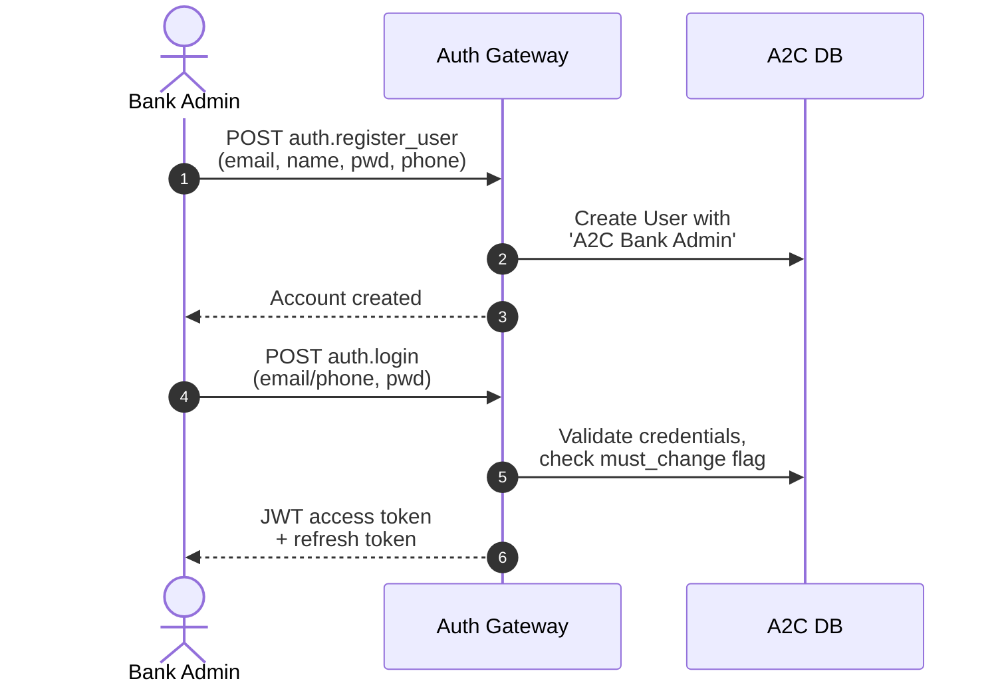
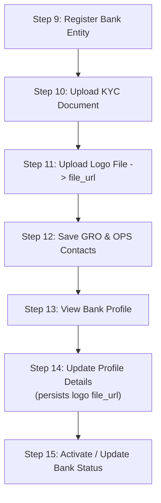
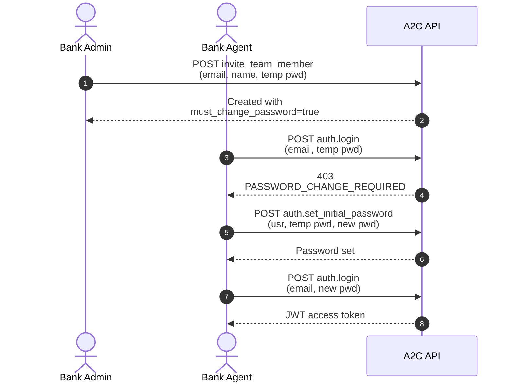

A comprehensive end-to-end API testing and integration guide for participating banks (Lenders / Sellers) in the OAN A2C Loan Marketplace. This document covers administrator self-registration, bank entity onboarding & KYC compliance, team member delegation, catalog & taxonomy management, custom pipeline status configuration, loan application underwriting, and notification events.

Every endpoint documented here is callable by an `A2C Bank Admin` or `A2C Bank Agent`. Lead capture and qualification belong to the `A2C Development Agent` and are covered in a separate guide — see [Role Capability Boundaries](#4-role-capability-boundaries) and the [Appendix](#appendix-endpoints-outside-the-bank-role) for the exact division.

---

## Architecture & Security Standards

### 1. Authentication Scheme

All authenticated requests must include a valid Bearer JWT token in the `Authorization` header:

```http
Authorization: Bearer <jwt_access_token>
```

- **Access Tokens:** Short-lived (**15 minutes**) issued upon successful login or token refresh.
- **Refresh Tokens:** Stored securely and rotated (**1 day** default validity, or **30 days** if `remember_me` was selected).
- **Temporary Passwords & Initial Password Setup:** When a Bank Admin invites a Bank Agent, a temporary password is assigned with `must_change_password: true`. The agent must call `oan_a2c.api.auth.set_initial_password` before establishing an authenticated session.

### 2. Multi-Tenancy & Bank Scope Isolation

- Bank isolation is strictly enforced via `@bank_scoped` and SQL query hooks.
- Bank Admins and Bank Agents are bound to their organization via Frappe `User Permission` (`allow: "A2C Participating Bank"`).
- Requests attempting to access or modify resources across different bank entities are rejected with HTTP 403 (`PERMISSION_DENIED` or `BANK_NOT_ONBOARDED`).

### 3. Response Envelope Structure

All endpoints return standard JSON envelopes:

- **Success (HTTP 200):**
  ```json
  {
    "status": "success",
    "message": "Human-readable status message",
    "data": {},
    "pagination": null
  }
  ```
- **Error (HTTP 4xx / 5xx):**
  ```json
  {
    "status": "error",
    "message": "Human-readable error description",
    "code": "VALIDATION_ERROR | AUTHENTICATION_ERROR | PERMISSION_DENIED | BANK_NOT_ONBOARDED | NOT_FOUND | INTERNAL_ERROR",
    "details": {}
  }
  ```

### 4. Role Capability Boundaries

Every endpoint in this guide is callable by `A2C Bank Admin`, `A2C Bank Agent`, or both. Two boundaries are enforced below the API layer and are the most common source of unexpected `PERMISSION_DENIED` responses:

**Bank roles are read-only on `A2C Loan Application`.** Bank Admin and Bank Agent hold `read` DocPerm only — no `write`, no `create`. The single authorised mutation is `update_loan_status` (Step 36), which gates on `read` and delegates authorisation to the workflow's per-role transition table. Creating applications, editing applicant profiles, assigning officers, updating step progress, and attaching or deleting supporting documents are **Development Agent operations** and are out of scope for this guide.

**Bank roles hold no DocPerm on `A2C Lead`** (nor on `A2C Visit Schedule` / `A2C Credit Information`). The entire lead-management surface — capture, qualification, assignment, comments, timeline, call logs, and field-visit scheduling — belongs to the `A2C Development Agent`. Banks enter the journey at the loan application, which a Development Agent creates from a qualified lead.

Marketplace **taxonomy terms are platform-governed**: banks read categories, tags, and attributes and map them onto their own products, but cannot mint new terms. `create_category`, `create_tag`, and `create_attribute_term` require `A2C Administrator`.

Within a bank, admin-only operations are: KYC upload, bank status transitions, product activation/rejection/archival, pipeline stage authoring, and all team-management calls. Everything else is available to both roles.

---

## Phase 1: Administrator Registration & Authentication



### Step 1: Bank Administrator User Registration

**POST** `/api/method/oan_a2c.api.v1.auth.register_user`

Registers the initial primary Bank Administrator account with the platform role `A2C Bank Admin`.

#### Expected Request Body

```json
{
  "email": "{{email}}",
  "full_name": "{{full_name}}",
  "password": "{{password}}",
  "phone_number": "{{phone_number}}",
  "role": "{{role}}"
}
```

#### Variables

| Variable           | Type   | Required | Description                                                           | Example          |
| :----------------- | :----- | :------- | :-------------------------------------------------------------------- | :--------------- |
| `{{email}}`        | string | Yes      | Valid corporate email address                                         | `admin@bank.com` |
| `{{full_name}}`    | string | Yes      | Administrator's full name (min 2 chars)                               | `Abebe Kebede`   |
| `{{password}}`     | string | Yes      | Password (min 8 chars, 1 uppercase, 1 lowercase, 1 number, 1 special) | `Password123!`   |
| `{{phone_number}}` | string | Yes      | International format phone number                                     | `+251911111111`  |
| `{{role}}`         | string | No       | Default: `A2C Bank Admin`                                             | `A2C Bank Admin` |

#### Success Response

```json
{
  "status": "success",
  "message": "Account created successfully.",
  "data": {
    "message": "Account created successfully."
  }
}
```

> **Note:** If the email or phone number is already registered, the endpoint returns:
> `{"status": "success", "message": "You already have an account. Please log in.", "data": {"message": "You already have an account. Please log in.", "already_exists": true}}`

#### User Interface

The initial signup interface for the prospective bank administrator.


---

### Step 2: Authentication & Token Generation (Login)

**POST** `/api/method/oan_a2c.api.auth.login`

Authenticates user credentials and issues a stateless JWT Bearer token along with a database-backed refresh token.

#### Expected Request Body

```json
{
  "usr": "{{usr}}",
  "pwd": "{{pwd}}",
  "remember_me": {{remember_me}}
}
```

#### Variables

| Variable          | Type    | Required | Description                                                             | Example          |
| :---------------- | :------ | :------- | :---------------------------------------------------------------------- | :--------------- |
| `{{usr}}`         | string  | Yes      | Registered email address or mobile phone number                         | `admin@bank.com` |
| `{{pwd}}`         | string  | Yes      | Account password                                                        | `Password123!`   |
| `{{remember_me}}` | boolean | No       | Extends refresh token lifespan from 1 day to 30 days (default: `false`) | `false`          |

#### Success Response

```json
{
  "status": "success",
  "message": "Success",
  "data": {
    "token": "eyJhbGciOiJIUzI1NiIsIn...",
    "refresh_token": "a1b2c3d4e5f67890abcdef...",
    "user": {
      "email": "admin@bank.com",
      "full_name": "Abebe Kebede",
      "roles": ["A2C Bank Admin"],
      "user_type": "bank",
      "bank": null,
      "bank_id": null,
      "bank_code": null,
      "bank_name": null,
      "bank_status": null
    }
  }
}
```

#### User Interface

Portal login screen where credentials are exchanged for a JWT session.


---

### Step 3: Refresh Access Token

**POST** `/api/method/oan_a2c.api.auth.refresh`

Refreshes an expired short-lived access token using a valid refresh token.

#### Expected Request Body

```json
{
  "refresh_token": "{{refresh_token}}"
}
```

#### Success Response

```json
{
  "status": "success",
  "message": "Success",
  "data": {
    "token": "eyJhbGciOiJIUzI1NiIsIn...",
    "refresh_token": "b2c3d4e5f6g78901bcdefg..."
  }
}
```

---

### Step 4: Verify Identity & Current Session Context (`get_me`)

**GET** `/api/method/oan_a2c.api.auth.get_me`

Fetches current identity, active platform roles, and associated bank context.

#### Success Response

```json
{
  "status": "success",
  "message": "Success",
  "data": {
    "email": "admin@bank.com",
    "full_name": "Abebe Kebede",
    "roles": ["A2C Bank Admin"],
    "user_type": "bank",
    "bank": "A2C-BANK-0001",
    "bank_id": "A2C-BANK-0001",
    "bank_code": "BNK001",
    "bank_name": "Example Bank",
    "bank_status": "In Review"
  }
}
```

---

### Step 5: Get & Update Personal User Profile

**GET** `/api/method/oan_a2c.api.auth.get_user_profile`
**POST** `/api/method/oan_a2c.api.auth.update_profile`

Enables users to fetch and update their personal user profile settings.

#### Expected Request Body (`update_profile`)

```json
{
  "full_name": "{{full_name}}",
  "phone_number": "{{phone_number}}",
  "language": "{{language}}",
  "user_image": "{{user_image}}",
  "gender": "{{gender}}"
}
```

#### Variables

| Variable           | Type   | Required | Description                            | Example                   |
| :----------------- | :----- | :------- | :------------------------------------- | :------------------------ |
| `{{full_name}}`    | string | No       | User's updated full name               | `Abebe Kebede`            |
| `{{phone_number}}` | string | No       | Updated phone number                   | `+251911111111`           |
| `{{language}}`     | string | No       | Language preference (`en`, `am`, `om`) | `en`                      |
| `{{user_image}}`   | string | No       | File URL of uploaded avatar            | `/files/admin_avatar.png` |
| `{{gender}}`       | string | No       | Gender (`Male`, `Female`, `Other`)     | `Male`                    |

#### Success Response

```json
{
  "status": "success",
  "message": "Profile updated successfully.",
  "data": {
    "message": "Profile updated successfully."
  }
}
```

#### UI

![[Pasted image 20260828130817.png]]

---

### Step 6: Change Password (Authenticated User)

**POST** `/api/method/oan_a2c.api.auth.change_password`

Allows a logged-in user to change their existing password.

#### Expected Request Body

```json
{
  "current_password": "{{current_password}}",
  "new_password": "{{new_password}}"
}
```

#### Success Response

```json
{
  "status": "success",
  "message": "Password changed successfully.",
  "data": {
    "message": "Password changed successfully."
  }
}
```

![[Pasted image 20260828130916.png]]

---

### Step 7: Logout & Session Termination

**POST** `/api/method/oan_a2c.api.auth.logout`

Invalidates and revokes the active refresh token.

#### Expected Request Body

```json
{
  "refresh_token": "{{refresh_token}}"
}
```

#### Success Response

```json
{
  "status": "success",
  "message": "Logged out successfully.",
  "data": {
    "message": "Logged out successfully."
  }
}
```

## ![[Pasted image 20260828131123.png]]

### Step 8: Password Recovery Flow (Forgot & Reset Password)

**POST** `/api/method/oan_a2c.api.auth.forgot_password`
**POST** `/api/method/oan_a2c.api.auth.reset_password`

#### Expected Request Body (`forgot_password`)

```json
{
  "email": "admin@bank.com"
}
```

#### Expected Request Body (`reset_password`)

```json
{
  "email": "admin@bank.com",
  "key": "{{reset_key}}",
  "new_password": "{{new_password}}"
}
```

#### Success Response (`reset_password`)

```json
{
  "status": "success",
  "message": "Your password has been successfully updated. You may now login.",
  "data": {
    "message": "Your password has been successfully updated. You may now login."
  }
}
```

---

## Phase 2: Bank Organization Registration & Compliance Onboarding



> **Note on the logo:** Step 11 only stores the file and returns its `file_url`. Nothing is attached to the bank record until that URL is passed as the `logo` field in Step 14.
>
> The returned `file_url` does **not** preserve the filename you uploaded — the file is stored under a random 32-character name with the original extension. `/files/` is served without a permission check, so a predictable name would let anyone fetch the branding of a bank that has not launched yet. Always persist the `file_url` the API returns rather than constructing one from `{{filename}}`.

### Step 9: Register Bank Entity

**POST** `/api/method/oan_a2c.api.v1.seller.onboarding.register_bank`

Registers a new participating bank entity with initial status `In Review`, creating the `A2C Participating Bank` record and automatically creating a default `User Permission` linking the caller to this bank.

> **Requirement:** Requires JWT Bearer token. Caller must not already be associated with an existing bank.

#### Expected Request Body

```json
{
  "bank_name": "{{bank_name}}",
  "bank_code": "{{bank_code}}",
  "entity_type": "{{entity_type}}",
  "registered_street": "{{registered_street}}",
  "registered_region": "{{registered_region}}",
  "registered_country": "{{registered_country}}",
  "registered_postal_code": "{{registered_postal_code}}",
  "registered_email": "{{registered_email}}",
  "registered_phone": "{{registered_phone}}",
  "registered_kebele_village": "{{registered_kebele_village}}",
  "registered_woreda_district": "{{registered_woreda_district}}",
  "registered_zone": "{{registered_zone}}",
  "website": "{{website}}"
}
```

#### Variables

| Variable                         | Type   | Required | Description                             | Example                       |
| :------------------------------- | :----- | :------- | :-------------------------------------- | :---------------------------- |
| `{{bank_name}}`                  | string | Yes      | Legal name of the bank (2-140 chars)    | `Example Commercial Bank`     |
| `{{bank_code}}`                  | string | Yes      | TIN / Unique tax identifier             | `BNK001`                      |
| `{{entity_type}}`                | string | Yes      | Legal entity type (`Bank`, `MFI`, etc.) | `Bank`                        |
| `{{registered_street}}`          | string | Yes      | Registered street address               | `Bole Road, Tower 4`          |
| `{{registered_region}}`          | string | Yes      | State / Administrative Region           | `Addis Ababa`                 |
| `{{registered_country}}`         | string | Yes      | Country name                            | `Ethiopia`                    |
| `{{registered_postal_code}}`     | string | Yes      | Postal Code (3-10 numeric/alphanumeric) | `1000`                        |
| `{{registered_email}}`           | string | Yes      | Official corporate contact email        | `contact@examplebank.com`     |
| `{{registered_phone}}`           | string | Yes      | Official corporate phone number         | `+251900000000`               |
| `{{registered_kebele_village}}`  | string | No       | Kebele / Village                        | `Kebele 03`                   |
| `{{registered_woreda_district}}` | string | No       | Woreda / District                       | `Bole Sub-City`               |
| `{{registered_zone}}`            | string | No       | Zone                                    | `Addis Ababa Zone`            |
| `{{website}}`                    | string | No       | Official HTTPS website URL              | `https://www.examplebank.com` |

#### Success Response

```json
{
  "status": "success",
  "message": "Bank registered successfully. Currently in review.",
  "data": {
    "message": "Bank registered successfully. Currently in review.",
    "bank_code": "BNK001",
    "bank_id": "A2C-BANK-0001"
  }
}
```

#### User Interface

The initial organization registration wizard form capturing legal entity details and corporate address.


---

### Step 10: Upload Mandatory KYC Compliance Document

**POST** `/api/method/oan_a2c.api.v1.seller.onboarding.upload_kyc_document`

Uploads the mandatory regulatory KYC document (banking license, certificate of incorporation) as a private PDF attachment.

> **Permissions:** Restricted to `A2C Bank Admin`.

#### Expected Request Body

```json
{
  "filename": "{{filename}}",
  "filedata": "{{filedata}}"
}
```

#### Variables

| Variable       | Type   | Required | Description                                  | Example                   |
| :------------- | :----- | :------- | :------------------------------------------- | :------------------------ |
| `{{filename}}` | string | Yes      | Document filename (must end in `.pdf`)       | `banking_license.pdf`     |
| `{{filedata}}` | string | Yes      | Base64-encoded PDF binary payload (max 15MB) | `JVBERi0xLjQKJeLjz9MK...` |

#### Success Response

```json
{
  "status": "success",
  "message": "KYC document uploaded successfully.",
  "data": {
    "message": "KYC document uploaded successfully.",
    "file_url": "/private/files/banking_license.pdf"
  }
}
```

#### User Interface

Compliance document upload screen allowing the administrator to attach regulatory verification documents.


---

### Step 11: Upload Bank Logo / Public Asset

**POST** `/api/method/oan_a2c.api.v1.seller.onboarding.upload_image`

Uploads a public image file (PNG, JPEG, or WebP) for use as the bank's marketplace brand logo.

#### Expected Request Body

```json
{
  "filename": "{{filename}}",
  "filedata": "{{filedata}}"
}
```

#### Variables

| Variable       | Type   | Required | Description                                                  | Example                       |
| :------------- | :----- | :------- | :----------------------------------------------------------- | :---------------------------- |
| `{{filename}}` | string | Yes      | Image filename ending in `.png`, `.jpg`, `.jpeg`, or `.webp` | `bank_logo.png`               |
| `{{filedata}}` | string | Yes      | Base64-encoded image string (max 5MB)                        | `iVBORw0KGgoAAAANSUhEUgAA...` |

#### Success Response

```json
{
  "status": "success",
  "message": "Image uploaded successfully.",
  "data": {
    "message": "Image uploaded successfully.",
    "file_url": "/files/8f21c0b4e95d47a3bd6178e2c0f4a91d.png"
  }
}
```

![[Pasted image 20260828132455.png]]

---

### Step 12: Save Organization Compliance Contacts (GRO & OPS)

**POST** `/api/method/oan_a2c.api.v1.seller.onboarding.save_org_contacts`

Records the Grievance Redressal Officer (GRO) and Operations (OPS) point-of-contact details for regulatory compliance.

> **Permissions:** Any authenticated bank user (`A2C Bank Admin` or `A2C Bank Agent`). Note that the values are read back only by Bank Admins (Step 13).

#### Expected Request Body

```json
{
  "gro_name": "{{gro_name}}",
  "gro_mobile": "{{gro_mobile}}",
  "ops_name": "{{ops_name}}",
  "ops_mobile": "{{ops_mobile}}"
}
```

#### Variables

| Variable         | Type   | Required | Description                           | Example              |
| :--------------- | :----- | :------- | :------------------------------------ | :------------------- |
| `{{gro_name}}`   | string | Yes      | Grievance Redressal Officer full name | `Abebe GRO Officer`  |
| `{{gro_mobile}}` | string | Yes      | GRO contact mobile phone              | `+251911111111`      |
| `{{ops_name}}`   | string | Yes      | Operations Manager full name          | `Kebede OPS Manager` |
| `{{ops_mobile}}` | string | Yes      | Operations contact mobile phone       | `+251922222222`      |

#### Success Response

```json
{
  "status": "success",
  "message": "Contacts saved successfully.",
  "data": {
    "message": "Contacts saved successfully."
  }
}
```

#### User Interface

The onboarding wizard section where grievance and operational contact details are captured.


---

### Step 13: View Bank Profile Details

**GET** `/api/method/oan_a2c.api.v1.seller.onboarding.get_bank_profile`

Retrieves the bank's registration information, address, logo, and onboarding verification statuses.

> **Role Context:** For `A2C Bank Admin`, the response includes confidential compliance fields (`kyc_document`, `gro_name`, `ops_name`, `kyc_document_uploaded`, `org_grievance_updated`). `A2C Bank Agent` receives the public organization profile.

#### Success Response

```json
{
  "status": "success",
  "message": "Success",
  "data": {
    "bank_id": "A2C-BANK-0001",
    "bank_code": "BNK001",
    "bank_name": "Example Commercial Bank",
    "brand_name": "Example Bank",
    "entity_type": "Bank",
    "logo": "/files/bank_logo.png",
    "registered_street": "Bole Road, Tower 4",
    "registered_kebele_village": "Kebele 03",
    "registered_woreda_district": "Bole Sub-City",
    "registered_zone": "Addis Ababa Zone",
    "registered_region": "Addis Ababa",
    "registered_country": "Ethiopia",
    "registered_postal_code": "1000",
    "registered_email": "contact@examplebank.com",
    "registered_phone": "+251900000000",
    "website": "https://www.examplebank.com",
    "status": "In Review",
    "gro_name": "Abebe GRO Officer",
    "gro_mobile": "+251911111111",
    "ops_name": "Kebede OPS Manager",
    "ops_mobile": "+251922222222",
    "kyc_document": "/private/files/banking_license.pdf",
    "kyc_document_uploaded": true,
    "org_grievance_updated": true
  }
}
```

## ![[Pasted image 20260828132503.png]]

### Step 14: Update Organization Profile

**POST** `/api/method/oan_a2c.api.v1.seller.onboarding.update_bank_profile`

Modifies editable profile fields, branding information, and contact details for the bank. Pass the `file_url` returned by Step 11 as `logo` to publish the bank's marketplace brand logo.

> **Permissions:** Any authenticated bank user (`A2C Bank Admin` or `A2C Bank Agent`). This endpoint carries no admin-only gate.

#### Expected Request Body

```json
{
  "brand_name": "{{brand_name}}",
  "website": "{{website}}",
  "logo": "{{logo}}",
  "registered_street": "{{registered_street}}",
  "registered_phone": "{{registered_phone}}"
}
```

#### Success Response

```json
{
  "status": "success",
  "message": "Organization profile updated successfully.",
  "data": {
    "message": "Organization profile updated successfully."
  }
}
```

![[Pasted image 20260828132519.png]]

---

### Step 15: Activate / Update Bank Status

**POST** `/api/method/oan_a2c.api.v1.seller.onboarding.update_bank_status`

Transitions the bank's platform status. Must be set to `Active` before loan products can be created and offered on the marketplace.

> **Permissions:** Restricted to `A2C Bank Admin` (or a platform administrator, who must additionally supply `bank_code`).

#### Expected Request Body

```json
{
  "new_status": "{{new_status}}",
  "bank_code": "{{bank_code}}"
}
```

#### Variables

| Variable         | Type   | Required | Description                                                  | Example  |
| :--------------- | :----- | :------- | :----------------------------------------------------------- | :------- |
| `{{new_status}}` | string | Yes      | Target status (`In Review`, `Active`, `Suspended`)           | `Active` |
| `{{bank_code}}`  | string | No       | Required only when called by unbound platform administrators | `BNK001` |

#### Success Response

```json
{
  "status": "success",
  "message": "Bank status updated to Active",
  "data": {
    "message": "Bank status updated to Active"
  }
}
```

---

## Phase 3: Team Member Delegation & Management



### Step 16: Invite Team Member (Bank Agent)

**POST** `/api/method/oan_a2c.api.v1.seller.onboarding.invite_team_member`

Invites a loan officer / agent to join the bank with an initial temporary password.

> **Security Rules:**
>
> - Bank Admins can only create users with the role `A2C Bank Agent`.
> - The invited user is automatically assigned a default `User Permission` binding them to the caller's bank.
> - The account is created with `must_change_password: 1` flag, forcing the agent to rotate their password at initial sign-in.

#### Expected Request Body

```json
{
  "email": "{{email}}",
  "full_name": "{{full_name}}",
  "password": "{{password}}",
  "role": "{{role}}"
}
```

#### Variables

| Variable        | Type   | Required | Description                                          | Example          |
| :-------------- | :----- | :------- | :--------------------------------------------------- | :--------------- |
| `{{email}}`     | string | Yes      | Bank Agent corporate email                           | `agent@bank.com` |
| `{{full_name}}` | string | Yes      | Bank Agent full name                                 | `Tigist Bekele`  |
| `{{password}}`  | string | Yes      | Temporary password (min 8 chars, 1 letter, 1 number) | `TempPass123`    |
| `{{role}}`      | string | No       | Must be `A2C Bank Agent` (default: `A2C Bank Agent`) | `A2C Bank Agent` |

#### Success Response

```json
{
  "status": "success",
  "message": "Team member invited successfully.",
  "data": {
    "message": "Team member invited successfully."
  }
}
```

#### User Interface

The team management interface where administrators invite officers and review user lists.

![[Pasted image 20260828132635.png]]

---

### Step 17: Agent First-Time Login & Password Initialization

**POST** `/api/method/oan_a2c.api.auth.set_initial_password`

When an invited agent attempts to log in with their temporary password, login rejects with `PASSWORD_CHANGE_REQUIRED`. The agent calls this endpoint (no token required) to exchange the temporary password for their permanent credential.

#### Expected Request Body

```json
{
  "usr": "{{usr}}",
  "current_password": "{{current_password}}",
  "new_password": "{{new_password}}"
}
```

#### Variables

| Variable               | Type   | Required | Description                          | Example                   |
| :--------------------- | :----- | :------- | :----------------------------------- | :------------------------ |
| `{{usr}}`              | string | Yes      | Agent email address                  | `agent@bank.com`          |
| `{{current_password}}` | string | Yes      | Temporary password provided by Admin | `TempPass123`             |
| `{{new_password}}`     | string | Yes      | Permanent complex password           | `MyNewSecurePassword123!` |

#### Success Response

```json
{
  "status": "success",
  "message": "Password set successfully. Please sign in with your new password.",
  "data": {
    "message": "Password set successfully. Please sign in with your new password."
  }
}
```

## ![[Pasted image 20260828132650.png]]

### Step 18: List Bank Team Members

**GET** `/api/method/oan_a2c.api.v1.seller.onboarding.list_users`

Lists all user accounts affiliated with the bank organization.

> **Permissions:** Restricted to `A2C Bank Admin`.

#### Success Response

```json
{
  "status": "success",
  "message": "Success",
  "data": {
    "users": [
      {
        "name": "agent@bank.com",
        "email": "agent@bank.com",
        "first_name": "Tigist Bekele",
        "enabled": 1,
        "last_active": "2026-08-28 10:15:00",
        "role": "A2C Bank Agent",
        "must_change_password": false
      }
    ]
  }
}
```

![[Pasted image 20260828132729.png]]

---

### Step 19: Update Team Member Profile & Status

**POST** `/api/method/oan_a2c.api.v1.seller.onboarding.update_user`

Enables Bank Admins to enable/disable agent accounts, update display names, or manage roles within the bank.

#### Expected Request Body

```json
{
  "email": "{{email}}",
  "full_name": "{{full_name}}",
  "role": "{{role}}",
  "enabled": {{enabled}}
}
```

#### Success Response

```json
{
  "status": "success",
  "message": "User updated successfully.",
  "data": {
    "message": "User updated successfully."
  }
}
```

---

### Step 20: Reset Team Member Password (Admin Intervention)

**POST** `/api/method/oan_a2c.api.v1.seller.onboarding.reset_member_password`

Issues a new temporary password for a Bank Agent who has forgotten their password or had their account compromised.

#### Expected Request Body

```json
{
  "email": "{{email}}",
  "password": "{{password}}"
}
```

#### Success Response

```json
{
  "status": "success",
  "message": "Temporary password issued. The agent must set their own password at next login.",
  "data": {
    "message": "Temporary password issued. The agent must set their own password at next login."
  }
}
```

![[Pasted image 20260828132715.png]]

---

## Phase 4: Seller Dashboard & Analytics

### Step 21: Get Dashboard Key Metrics

**GET** `/api/method/oan_a2c.api.v1.seller.dashboard.get_stats`

Retrieves cached, high-performance aggregated metrics on active products, pipeline applications, and total approved loan volumes.

#### Success Response

```json
{
  "status": "success",
  "message": "Success",
  "data": {
    "stats": {
      "total_products": 10,
      "active_products": 8,
      "total_applications": 150,
      "pending_applications": 45,
      "approved_applications": 20,
      "total_approved_amount": 10000000.0
    }
  }
}
```

## ![[Pasted image 20260828132802.png]]

## Phase 5: Loan Products, Catalog & Taxonomy Management

### Step 22: Create Loan Product (Single or Bulk)

**POST** `/api/method/oan_a2c.api.v1.seller.loan_products.create_product`

Creates new loan product offerings under the bank with initial status `Pending Approval`.

> **Note:** The bank must be in `Active` status to create products. Supports single product definition or bulk creation via the `products` array (up to 10 products per call).

#### Expected Request Body (Single Product)

```json
{
  "product_name": "{{product_name}}",
  "min_interest_rate": {{min_interest_rate}},
  "max_interest_rate": {{max_interest_rate}},
  "min_amount": {{min_amount}},
  "max_amount": {{max_amount}},
  "tenure_months": {{tenure_months}},
  "description": "{{description}}",
  "image": "{{image}}",
  "product_meta": [
    {
      "meta_key": "repayment_frequency",
      "meta_value": "Monthly"
    }
  ]
}
```

#### Variables

| Variable                | Type    | Required | Description                      | Example                                                    |
| :---------------------- | :------ | :------- | :------------------------------- | :--------------------------------------------------------- |
| `{{product_name}}`      | string  | Yes      | Name of the loan product         | `Smallholder Agricultural Loan`                            |
| `{{min_interest_rate}}` | float   | Yes      | Minimum annual interest rate (%) | `10.5`                                                     |
| `{{max_interest_rate}}` | float   | No       | Maximum annual interest rate (%) | `14.0`                                                     |
| `{{min_amount}}`        | integer | No       | Minimum loan amount in ETB       | `5000`                                                     |
| `{{max_amount}}`        | integer | Yes      | Maximum loan amount in ETB       | `50000`                                                    |
| `{{tenure_months}}`     | integer | Yes      | Loan tenure duration in months   | `12`                                                       |
| `{{description}}`       | string  | No       | Comprehensive product details    | `Input financing for smallholder farmers.`                 |
| `{{image}}`             | string  | No       | Image file URL                   | `/files/agri_loan.png`                                     |
| `{{product_meta}}`      | array   | No       | Custom key-value pairs           | `[{"meta_key": "grace_period_months", "meta_value": "3"}]` |

#### Success Response

```json
{
  "status": "success",
  "message": "Products created",
  "data": {
    "message": "Products created",
    "product_ids": [
      "PROD-2026-0001"
    ]
  }
}
```

#### User Interface

The product creation wizard where financial terms, interest bands, and repayment terms are configured.

![[Pasted image 20260828132831.png]]

---

### Step 23: Update Loan Product

**POST** `/api/method/oan_a2c.api.v1.seller.loan_products.update_product`

Updates terms, interest rates, amounts, or metadata of an existing loan product.

#### Expected Request Body

```json
{
  "product_id": "{{product_id}}",
  "product_name": "{{product_name}}",
  "min_interest_rate": {{min_interest_rate}},
  "max_interest_rate": {{max_interest_rate}},
  "max_amount": {{max_amount}},
  "tenure_months": {{tenure_months}}
}
```

#### Success Response

```json
{
  "status": "success",
  "message": "Product updated",
  "data": {
    "message": "Product updated",
    "product_id": "PROD-2026-0001",
    "status": "Pending Approval"
  }
}
```

![[Pasted image 20260828132901.png]]

---

### Step 24: Approve Loan Product / Transition Status

**POST** `/api/method/oan_a2c.api.v1.seller.loan_products.set_product_status`

Transitions a product's lifecycle status. Setting status to `Active` publishes the product to the marketplace catalog for farmers.

> **Permissions:** Setting status to `Active`, `Rejected`, or `Archived` is restricted to `A2C Bank Admin` and requires a non-empty `reason`.

#### Expected Request Body

```json
{
  "product_id": "{{product_id}}",
  "status": "{{status}}",
  "reason": "{{reason}}"
}
```

#### Variables

| Variable         | Type   | Required    | Description                                                          | Example                                         |
| :--------------- | :----- | :---------- | :------------------------------------------------------------------- | :---------------------------------------------- |
| `{{product_id}}` | string | Yes         | Loan product document name                                           | `PROD-2026-0001`                                |
| `{{status}}`     | string | Yes         | Target status (`Pending Approval`, `Active`, `Rejected`, `Archived`) | `Active`                                        |
| `{{reason}}`     | string | Conditional | Mandatory when status is `Active`, `Rejected`, or `Archived`         | `Product pricing approved by credit committee.` |

#### Success Response

```json
{
  "status": "success",
  "message": "Product status updated to Active",
  "data": {
    "message": "Product status updated to Active",
    "product_id": "PROD-2026-0001",
    "status": "Active"
  }
}
```

#### User Interface

The product review dashboard where an administrator inspects terms and publishes the product to the marketplace.

![[Pasted image 20260828132928.png]]

---

### Step 25: List & Search Loan Products

**GET** `/api/method/oan_a2c.api.v1.seller.loan_products.list_products`

Paginated listing of the bank's catalog with faceted filtering on status, category, tag, interest rates, loan amounts, and tenure.

#### Query Parameters

| Parameter           | Type    | Required | Description                                           | Example        |
| :------------------ | :------ | :------- | :---------------------------------------------------- | :------------- |
| `status`            | string  | No       | Filter by status (`Pending Approval`, `Active`, etc.) | `Active`       |
| `search`            | string  | No       | Search keyword in product name                        | `Agricultural` |
| `category`          | string  | No       | Filter by category ID                                 | `crop-loan`    |
| `tag`               | string  | No       | Filter by tag ID                                      | `seasonal`     |
| `min_interest_rate` | float   | No       | Lower bound interest filter                           | `8.0`          |
| `max_interest_rate` | float   | No       | Upper bound interest filter                           | `15.0`         |
| `min_amount`        | float   | No       | Lower bound loan amount                               | `1000`         |
| `max_amount`        | float   | No       | Upper bound loan amount                               | `100000`       |
| `tenure_months`     | integer | No       | Exact tenure match                                    | `12`           |
| `page`              | integer | No       | Page number (default: `1`)                            | `1`            |
| `page_size`         | integer | No       | Items per page (default: `20`)                        | `20`           |

#### Success Response

```json
{
  "status": "success",
  "message": "Success",
  "data": {
    "products": [
      {
        "name": "PROD-2026-0001",
        "product_name": "Smallholder Agricultural Loan",
        "slug": "smallholder-agricultural-loan",
        "status": "Active",
        "bank": "A2C-BANK-0001",
        "bank_name": "Example Commercial Bank",
        "min_interest_rate": 10.5,
        "max_interest_rate": 14.0,
        "min_amount": 5000.0,
        "max_amount": 50000.0,
        "tenure_months": 12,
        "image": "/files/agri_loan.png",
        "categories": ["crop-loan"],
        "applications_count": 18,
        "creation": "2026-08-28 09:00:00"
      }
    ]
  },
  "pagination": {
    "page": 1,
    "page_size": 20,
    "total": 1,
    "total_pages": 1,
    "has_next": false
  }
}
```

## ![[Pasted image 20260828133003.png]]

### Step 26: Get Loan Product Detail

**GET** `/api/method/oan_a2c.api.v1.seller.loan_products.get_product`

Fetches the complete loan product record, including associated taxonomy categories, tags, attributes, and custom metadata.

#### Query Parameters

| Parameter    | Type   | Required | Description                  | Example          |
| :----------- | :----- | :------- | :--------------------------- | :--------------- |
| `product_id` | string | Yes      | Document name of the product | `PROD-2026-0001` |

#### Success Response

```json
{
  "status": "success",
  "message": "Success",
  "data": {
    "product": {
      "name": "PROD-2026-0001",
      "product_name": "Smallholder Agricultural Loan",
      "slug": "smallholder-agricultural-loan",
      "status": "Active",
      "min_interest_rate": 10.5,
      "max_interest_rate": 14.0,
      "min_amount": 5000.0,
      "max_amount": 50000.0,
      "tenure_months": 12,
      "description": "Input financing for smallholder farmers.",
      "image": "/files/agri_loan.png",
      "bank": "A2C-BANK-0001",
      "creation": "2026-08-28T09:00:00Z",
      "modified": "2026-08-28T09:30:00Z",
      "is_saved": false,
      "product_meta": [
        {
          "meta_key": "repayment_frequency",
          "meta_value": "Monthly"
        }
      ],
      "categories": ["crop-loan"],
      "tags": ["seasonal"],
      "attributes": {
        "crop_type": ["wheat", "maize"]
      }
    }
  }
}
```

![[Pasted image 20260828133014.png]]

---

### Step 27: Get Product Audit History & Comments

**GET** `/api/method/oan_a2c.api.v1.seller.loan_products.get_product_comment`

Retrieves status transition history and audit reasons for a loan product.

#### Success Response

```json
{
  "status": "success",
  "message": "Success",
  "data": {
    "comment": [
      {
        "name": "AUD-0001",
        "creation": "2026-08-28T09:30:00Z",
        "event_type": "Status Changed",
        "from_status": "Pending Approval",
        "to_status": "Active",
        "event_title": "Status Updated",
        "event_description": "Status changed to Active",
        "reason": "Product pricing approved by credit committee.",
        "performed_by": "admin@bank.com"
      }
    ]
  }
}
```

---

### Step 28: Taxonomy Discovery (Categories, Tags & Attributes)

**GET** `/api/method/oan_a2c.api.v1.seller.taxonomy.get_categories`
**GET** `/api/method/oan_a2c.api.v1.seller.taxonomy.get_tags`
**GET** `/api/method/oan_a2c.api.v1.seller.taxonomy.get_attributes`

Lists standard taxonomy metadata available on the marketplace.

#### Success Response (`get_categories`)

```json
{
  "status": "success",
  "message": "Success",
  "data": {
    "categories": [
      {
        "term_id": "crop-loan",
        "term_name": "Crop Loan",
        "parent_category": "agriculture"
      }
    ]
  }
}
```

---

### Step 29: Assign Taxonomy to Loan Product

**POST** `/api/method/oan_a2c.api.v1.seller.taxonomy.set_product_categories`
**POST** `/api/method/oan_a2c.api.v1.seller.taxonomy.set_product_tags`
**POST** `/api/method/oan_a2c.api.v1.seller.taxonomy.set_product_attributes`

#### Expected Request Body (`set_product_categories`)

```json
{
  "product_id": "PROD-2026-0001",
  "term_ids": ["agriculture", "crop-loan"]
}
```

#### Expected Request Body (`set_product_attributes`)

```json
{
  "product_id": "PROD-2026-0001",
  "attributes": {
    "crop_type": ["wheat", "teff"]
  }
}
```

#### Success Response

```json
{
  "status": "success",
  "message": "Success",
  "data": {
    "message": "Categories updated"
  }
}
```

---

## Phase 6: Custom Loan Pipeline Stages Configuration

Each bank defines its own loan pipeline. Every stage maps onto one of three platform **archetype states** — `In Transition`, `Completed`, or `Rejected` — which is how the platform reasons about progress without knowing any individual bank's vocabulary. A default pipeline (`Submitted` → `Processed` → `Verified` → `Approved` → `Disbursed` / `Rejected`) is seeded at onboarding and can be replaced entirely.

> **Permissions:** `get_stages` is available to both bank roles. Authoring stages (`add_stage`, `sync_stages`) is restricted to `A2C Bank Admin`.

### Step 30: List Configured Pipeline Stages

**GET** `/api/method/oan_a2c.api.v1.seller.loan_stages.get_stages`

Fetches the customized loan workflow status stages for the caller's bank, with active application counts per stage.

#### Success Response

```json
{
  "status": "success",
  "message": "Loan status stages retrieved successfully",
  "data": {
    "stages": [
      {
        "name": "STG-0001",
        "bank": "A2C-BANK-0001",
        "stage_id": "kyc-verification",
        "label": "KYC Verification",
        "archetype_state": "In Transition",
        "sequence": 1,
        "external_code": "KYC_VERIF",
        "description": "Verifying national ID and registry consent",
        "application_count": 14,
        "creation": "2026-08-28 09:00:00",
        "modified": "2026-08-28 09:00:00"
      },
      {
        "name": "STG-0002",
        "bank": "A2C-BANK-0001",
        "stage_id": "credit-assessment",
        "label": "Credit Assessment",
        "archetype_state": "In Transition",
        "sequence": 2,
        "external_code": "CR_ASSESS",
        "description": "Underwriting credit bureau reports",
        "application_count": 8,
        "creation": "2026-08-28 09:00:00",
        "modified": "2026-08-28 09:00:00"
      }
    ],
    "bank": "A2C-BANK-0001"
  }
}
```

---

### Step 31: Add a Single Custom Pipeline Stage

**POST** `/api/method/oan_a2c.api.v1.seller.loan_stages.add_stage`

Adds a single new custom workflow stage to the bank's pipeline.

> **Permissions:** Restricted to `A2C Bank Admin`.

#### Expected Request Body

```json
{
  "label": "{{label}}",
  "archetype_state": "{{archetype_state}}",
  "sequence": {{sequence}},
  "external_code": "{{external_code}}",
  "description": "{{description}}"
}
```

#### Variables

| Variable              | Type    | Required | Description                                              | Example                                           |
| :-------------------- | :------ | :------- | :------------------------------------------------------- | :------------------------------------------------ |
| `{{label}}`           | string  | Yes      | Unique stage display label                               | `Collateral Valuation`                            |
| `{{archetype_state}}` | string  | Yes      | Must be one of: `In Transition`, `Completed`, `Rejected` | `In Transition`                                   |
| `{{sequence}}`        | integer | No       | Execution sequence ordering                              | `3`                                               |
| `{{external_code}}`   | string  | No       | Core Banking System stage mapping code                   | `CBS_COLLAT_VAL`                                  |
| `{{description}}`     | string  | No       | Stage operational description                            | `Physical inspection of agricultural collateral.` |

#### Success Response

```json
{
  "status": "success",
  "message": "Loan status stage added successfully",
  "data": {
    "name": "STG-0003",
    "stage_id": "collateral-valuation",
    "label": "Collateral Valuation",
    "archetype_state": "In Transition",
    "sequence": 3,
    "external_code": "CBS_COLLAT_VAL"
  }
}
```

---

### Step 32: Batch Sync / Reorder Entire Pipeline

**POST** `/api/method/oan_a2c.api.v1.seller.loan_stages.sync_stages`

Reorders, updates, adds, or prunes pipeline stages in a single atomic transaction.

> **Permissions:** Restricted to `A2C Bank Admin`.

#### Expected Request Body

```json
{
  "stages": [
    {
      "stage_id": "kyc-verification",
      "label": "KYC Verification",
      "archetype_state": "In Transition",
      "sequence": 1
    },
    {
      "stage_id": "credit-assessment",
      "label": "Credit Assessment",
      "archetype_state": "In Transition",
      "sequence": 2
    },
    {
      "label": "Final Approval",
      "archetype_state": "Completed",
      "sequence": 3
    }
  ]
}
```

#### Success Response

```json
{
  "status": "success",
  "message": "Loan status stages retrieved successfully",
  "data": {
    "stages": [ ... ],
    "bank": "A2C-BANK-0001"
  }
}
```

---

## Phase 7: Loan Application Underwriting & Processing

Applications reach a bank already created — a Development Agent converts a qualified lead into an `A2C Loan Application` scoped to the chosen bank. From that point the bank **reads** the application and **moves it through its own pipeline**. It does not author or edit the record.

> **Scope:** Bank roles hold `read` DocPerm on `A2C Loan Application`. The only authorised mutation is `update_loan_status` (Step 36), which is explicitly exempted: it gates on `read` and defers authorisation to the workflow's per-role transition table, so an agent can move only their own bank's applications.
>
> The following are **Development Agent operations** and will return `PERMISSION_DENIED` for a bank user — they are documented in the Development Agent guide, not here: `create_loan_application`, `update_basic_profile`, `get_basic_profile`, `assign_loan_officer`, `update_loan_step`, `upload_supporting_documents`, and `delete_supporting_document`.

### Step 33: List & Filter Loan Applications

**GET** `/api/method/oan_a2c.api.v1.loan_applications.get_all_loans`

Fetches a paginated list of loan applications scoped to the caller's bank.

#### Query Parameters

| Parameter         | Type    | Required | Description                                            | Example          |
| :---------------- | :------ | :------- | :----------------------------------------------------- | :--------------- |
| `status`          | string  | No       | Filter by pipeline stage label, stage ID, or archetype | `In Transition`  |
| `search_query`    | string  | No       | Search borrower name, phone, or application ID         | `Abebe`          |
| `loan_type`       | string  | No       | Filter by loan product type                            | `Crop Loan`      |
| `min_loan_amount` | float   | No       | Minimum loan amount filter                             | `10000`          |
| `max_loan_amount` | float   | No       | Maximum loan amount filter                             | `50000`          |
| `region`          | string  | No       | Applicant region                                       | `Oromia`         |
| `loan_officer`    | string  | No       | Assigned officer email                                 | `agent@bank.com` |
| `from_date`       | string  | No       | YYYY-MM-DD start filter                                | `2026-08-01`     |
| `to_date`         | string  | No       | YYYY-MM-DD end filter                                  | `2026-08-31`     |
| `page`            | integer | No       | Page number (default: `1`)                             | `1`              |
| `page_size`       | integer | No       | Page size (default: `20`)                              | `20`             |

#### Success Response

```json
{
  "status": "success",
  "message": "Loan applications retrieved successfully.",
  "data": {
    "loans": [
      {
        "name": "APP-2026-0001",
        "farmer_name": "Abebe Bikila",
        "phone_number": "+251911223344",
        "loan_product": "PROD-2026-0001",
        "loan_amount": 25000.0,
        "status": "KYC Verification",
        "stage_id": "kyc-verification",
        "stage_label": "KYC Verification",
        "current_step": 2,
        "assigned_loan_officer": "agent@bank.com",
        "region": "Oromia",
        "woreda": "Adama",
        "kebele": "Kebele 01",
        "creation": "2026-08-28 10:30:00"
      }
    ]
  },
  "pagination": {
    "page": 1,
    "page_size": 20,
    "total": 1,
    "total_pages": 1,
    "has_next": false
  }
}
```

![[Pasted image 20260828141318.png]]

---

### Step 34: Loan Summary Metrics & Metadata Facets

**GET** `/api/method/oan_a2c.api.v1.loan_applications.get_loan_summary`
**GET** `/api/method/oan_a2c.api.v1.loan_applications.get_loan_metadata`

#### Success Response (`get_loan_summary`)

```json
{
  "status": "success",
  "message": "Loan summary retrieved successfully.",
  "data": {
    "total_applications": 85,
    "in_transition": 35,
    "completed": 40,
    "rejected": 10,
    "total_disbursed_amount": 12500000.0
  }
}
```

![[Pasted image 20260828145409.png]]

---

### Step 35: View Full Borrower Underwriting Profile

**GET** `/api/method/oan_a2c.api.v1.loan_applications.get_full_profile`

Returns the complete underwriting record for one application: applicant identity, household composition, landholding, soil and moisture characteristics, certification, and current pipeline position. This is the endpoint a bank uses to review an applicant — it is keyed on the **application**, not the lead.

> **Note:** `get_basic_profile` is keyed on `lead_id` and requires DocPerm on `A2C Lead`, which bank roles do not hold. Use `get_full_profile` instead.

#### Query Parameters

| Parameter        | Type   | Required | Description                    | Example         |
| :--------------- | :----- | :------- | :----------------------------- | :-------------- |
| `application_id` | string | Yes      | Loan application document name | `APP-2026-0001` |

#### Success Response

The response is a **flat object** — there are no nested `personal` / `farm_details` / `crops` groupings.

```json
{
  "status": "success",
  "message": "Full profile retrieved successfully",
  "data": {
    "application_id": "APP-2026-0001",
    "lead_id": "LEAD-2026-0001",
    "first_name": "Abebe",
    "last_name": "Bikila",
    "region": "Oromia",
    "woreda": "Adama",
    "kebele": "Kebele 01",
    "language": "en",
    "phone_number": "+251911223344",
    "id_type": "Fayda",
    "id_number": "1234567890",
    "farmer_id": "FRM-2026-0001",
    "consent_id": "CNS-2026-0001",
    "loan_type": "Crop Loan",
    "loan_product": "PROD-2026-0001",
    "loan_product_name": "Smallholder Agricultural Loan",
    "loan_amount": 25000.0,
    "loan_reason": "Purchase of fertiliser and improved seed",
    "status": "KYC Verification",
    "stage_id": "kyc-verification",
    "sequence": 1,
    "is_terminal": false,
    "is_successful": false,
    "current_step": 2,
    "loan_officer": "agent@bank.com",
    "creation": "2026-08-28T10:30:00+03:00",
    "date_of_birth": "1985-04-12",
    "gender": "Male",
    "marital_status": "Married",
    "size_of_family": 6,
    "number_of_children": 4,
    "no_of_females_family": 3,
    "no_of_males_family": 3,
    "source_of_income": "Farming",
    "education_level": "Primary",
    "family_member_owns_land_independently": false,
    "total_farmland_size_as_landowner": 2.5,
    "total_farmland_size_as_crop_sharing": 0.5,
    "total_farmland_size_as_rented": 0.5,
    "farmland_size_hectares": 3.5,
    "land_ownership_status": "Owner",
    "soil_fertility_minerals": "Clay Loam",
    "moisture_levels": "Medium",
    "certification_id": "CERT-0099",
    "certification_photo_url": "/private/files/cert_0099.jpg"
  }
}
```

![[Pasted image 20260828141458.png]]

---

### Step 36: Update Loan Status / Move Pipeline Stage

**POST** `/api/method/oan_a2c.api.v1.loan_applications.update_loan_status`

Moves a loan application through the bank's pipeline. This is the **only** mutation a bank role may perform on an application.

The `status` value accepts either:

- a **bank-defined stage**, by label or stage ID — `KYC Verification`, `credit-assessment`, `Approved`, `Disbursed`; or
- an **archetype state** directly — `In Transition`, `Completed`, or `Rejected`.

> **Stage vs. archetype:** these are different things. `Approved` and `Disbursed` are _stage labels_ from the default pipeline, not archetypes. There are exactly three archetypes — `In Transition`, `Completed`, `Rejected` — and every stage maps onto one of them (see Phase 6). Moving between two stages that share an archetype (`Verified` → `Approved`, both `In Transition`) is a valid pipeline move that does not change the archetype.

#### Expected Request Body

```json
{
  "application_id": "{{application_id}}",
  "status": "{{status}}",
  "reason": "{{reason}}"
}
```

#### Variables

| Variable             | Type   | Required | Description                                                                                                 | Example                                                              |
| :------------------- | :----- | :------- | :---------------------------------------------------------------------------------------------------------- | :------------------------------------------------------------------- |
| `{{application_id}}` | string | Yes      | Loan application document name                                                                              | `APP-2026-0001`                                                      |
| `{{status}}`         | string | Yes      | Target stage label, stage ID, or archetype state (`Approved`, `credit-assessment`, `Completed`, `Rejected`) | `Approved`                                                           |
| `{{reason}}`         | string | No       | Underwriting notes / audit reason (recorded on the audit event)                                             | `All KYC and farm yield checks verified. Approved for disbursement.` |

#### Success Response

```json
{
  "status": "success",
  "message": "Loan status updated to Approved.",
  "data": {
    "message": "Loan status updated to Approved."
  }
}
```

#### User Interface

The loan processing dashboard where underwriting officers review applicant details, documents, and submit approval decisions.

![[Pasted image 20260828141525.png]]

---

## Phase 8: Real-time In-App Notifications

### Step 37: Get Notifications & Unread Counter

**GET** `/api/method/oan_a2c.api.v1.notifications.get_notifications`

Retrieves in-app notifications for the authenticated user along with the total unread badge count.

#### Query Parameters

| Parameter     | Type    | Required | Description                                                    | Example  |
| :------------ | :------ | :------- | :------------------------------------------------------------- | :------- |
| `read_status` | string  | No       | Filter by read state (`unread`, `read`, `all`; default: `all`) | `unread` |
| `limit`       | integer | No       | Max notifications to return (1-100; default: `20`)             | `20`     |
| `start`       | integer | No       | Offset index (default: `0`)                                    | `0`      |

#### Success Response

```json
{
  "status": "success",
  "message": "Notifications retrieved successfully",
  "data": {
    "unread_count": 3,
    "notifications": [
      {
        "id": "NOTIF-0001",
        "subject": "New Loan Application Submitted",
        "email_content": "Abebe Bikila has submitted application APP-2026-0001 for Smallholder Agricultural Loan.",
        "document_type": "A2C Loan Application",
        "document_name": "APP-2026-0001",
        "read": 0,
        "creation": "2026-08-28T10:30:00Z"
      }
    ]
  },
  "pagination": {
    "page": 1,
    "limit": 20,
    "total": 3,
    "total_pages": 1,
    "has_next": false
  }
}
```

---

### Step 38: Mark Notifications Read

**POST** `/api/method/oan_a2c.api.v1.notifications.mark_read`

Marks specific notification records as read, or marks all unread notifications read when `mark_all: true`.

#### Expected Request Body

```json
{
  "notification_ids": ["NOTIF-0001", "NOTIF-0002"],
  "mark_all": false
}
```

#### Success Response

```json
{
  "status": "success",
  "message": "Notifications marked as read",
  "data": {
    "updated": 2
  }
}
```

---

### Step 39: Clear / Delete Notifications

**POST** `/api/method/oan_a2c.api.v1.notifications.clear`

Permanently deletes selected notifications or clears all user notifications.

#### Expected Request Body

```json
{
  "notification_ids": ["NOTIF-0001"],
  "clear_all": false
}
```

#### Success Response

```json
{
  "status": "success",
  "message": "Notifications cleared",
  "data": {
    "deleted": 1
  }
}
```

![[Pasted image 20260828145458.png]]

---

## Summary of All Bank-Related API Endpoints

Every endpoint below is callable by a bank user. The **Role** column gives the minimum role required: _Admin_ means `A2C Bank Admin` only; _Both_ means either `A2C Bank Admin` or `A2C Bank Agent`.

| Category          | HTTP Method | Method / Endpoint Path                                                      | Role   | Description                                                   |
| :---------------- | :---------- | :-------------------------------------------------------------------------- | :----- | :------------------------------------------------------------ |
| **Auth**          | `POST`      | `/api/method/oan_a2c.api.v1.auth.register_user`                             | Public | Register new Bank Administrator                               |
| **Auth**          | `POST`      | `/api/method/oan_a2c.api.auth.login`                                        | Public | Authenticate & obtain JWT Bearer token                        |
| **Auth**          | `POST`      | `/api/method/oan_a2c.api.auth.refresh`                                      | Public | Refresh access token                                          |
| **Auth**          | `POST`      | `/api/method/oan_a2c.api.auth.set_initial_password`                         | Public | Rotate temporary password on first login                      |
| **Auth**          | `POST`      | `/api/method/oan_a2c.api.auth.forgot_password`                              | Public | Request password reset instructions                           |
| **Auth**          | `POST`      | `/api/method/oan_a2c.api.auth.reset_password`                               | Public | Complete password reset                                       |
| **Auth**          | `POST`      | `/api/method/oan_a2c.api.auth.logout`                                       | Public | Logout & revoke refresh token                                 |
| **Auth**          | `GET`       | `/api/method/oan_a2c.api.auth.get_me`                                       | Both   | Get current user context & bank association                   |
| **Auth**          | `GET`       | `/api/method/oan_a2c.api.auth.get_user_profile`                             | Both   | Get detailed user profile                                     |
| **Auth**          | `POST`      | `/api/method/oan_a2c.api.auth.update_profile`                               | Both   | Update user profile                                           |
| **Auth**          | `POST`      | `/api/method/oan_a2c.api.auth.change_password`                              | Both   | Change password for logged-in user                            |
| **Onboarding**    | `POST`      | `/api/method/oan_a2c.api.v1.seller.onboarding.register_bank`                | Both   | Register new bank organization                                |
| **Onboarding**    | `POST`      | `/api/method/oan_a2c.api.v1.seller.onboarding.upload_kyc_document`          | Admin  | Upload mandatory KYC PDF                                      |
| **Onboarding**    | `POST`      | `/api/method/oan_a2c.api.v1.seller.onboarding.upload_image`                 | Both   | Upload image file, returns `file_url`                         |
| **Onboarding**    | `POST`      | `/api/method/oan_a2c.api.v1.seller.onboarding.save_org_contacts`            | Both   | Save compliance contacts (GRO & OPS)                          |
| **Onboarding**    | `GET`       | `/api/method/oan_a2c.api.v1.seller.onboarding.get_bank_profile`             | Both   | Retrieve organization profile (compliance fields: Admin only) |
| **Onboarding**    | `POST`      | `/api/method/oan_a2c.api.v1.seller.onboarding.update_bank_profile`          | Both   | Update organization details & branding                        |
| **Onboarding**    | `POST`      | `/api/method/oan_a2c.api.v1.seller.onboarding.update_bank_status`           | Admin  | Update bank onboarding status (`Active`)                      |
| **Team**          | `POST`      | `/api/method/oan_a2c.api.v1.seller.onboarding.invite_team_member`           | Admin  | Invite Bank Agent team member                                 |
| **Team**          | `GET`       | `/api/method/oan_a2c.api.v1.seller.onboarding.list_users`                   | Admin  | List bank team members                                        |
| **Team**          | `POST`      | `/api/method/oan_a2c.api.v1.seller.onboarding.update_user`                  | Admin  | Update team member role/status                                |
| **Team**          | `POST`      | `/api/method/oan_a2c.api.v1.seller.onboarding.reset_member_password`        | Admin  | Reset agent temporary password                                |
| **Dashboard**     | `GET`       | `/api/method/oan_a2c.api.v1.seller.dashboard.get_stats`                     | Both   | Bank statistics & metric counters                             |
| **Catalog**       | `POST`      | `/api/method/oan_a2c.api.v1.seller.loan_products.create_product`            | Both   | Create loan product (single or bulk)                          |
| **Catalog**       | `POST`      | `/api/method/oan_a2c.api.v1.seller.loan_products.update_product`            | Both   | Update loan product parameters                                |
| **Catalog**       | `POST`      | `/api/method/oan_a2c.api.v1.seller.loan_products.set_product_status`        | Admin¹ | Approve / activate / archive loan product                     |
| **Catalog**       | `GET`       | `/api/method/oan_a2c.api.v1.seller.loan_products.list_products`             | Both   | Search & filter bank loan products                            |
| **Catalog**       | `GET`       | `/api/method/oan_a2c.api.v1.seller.loan_products.get_product`               | Both   | Get loan product details & terms                              |
| **Catalog**       | `GET`       | `/api/method/oan_a2c.api.v1.seller.loan_products.get_product_comment`       | Both   | Audit history & approval comments                             |
| **Taxonomy**      | `GET`       | `/api/method/oan_a2c.api.v1.seller.taxonomy.get_categories`                 | Both   | List taxonomy categories                                      |
| **Taxonomy**      | `GET`       | `/api/method/oan_a2c.api.v1.seller.taxonomy.get_tags`                       | Both   | List taxonomy tags                                            |
| **Taxonomy**      | `GET`       | `/api/method/oan_a2c.api.v1.seller.taxonomy.get_attributes`                 | Both   | List taxonomy attributes                                      |
| **Taxonomy**      | `POST`      | `/api/method/oan_a2c.api.v1.seller.taxonomy.set_product_categories`         | Both   | Map categories to loan product                                |
| **Taxonomy**      | `POST`      | `/api/method/oan_a2c.api.v1.seller.taxonomy.set_product_tags`               | Both   | Map tags to loan product                                      |
| **Taxonomy**      | `POST`      | `/api/method/oan_a2c.api.v1.seller.taxonomy.set_product_attributes`         | Both   | Map attributes to loan product                                |
| **Pipeline**      | `GET`       | `/api/method/oan_a2c.api.v1.seller.loan_stages.get_stages`                  | Both   | List custom pipeline stages                                   |
| **Pipeline**      | `POST`      | `/api/method/oan_a2c.api.v1.seller.loan_stages.add_stage`                   | Admin  | Add custom pipeline stage                                     |
| **Pipeline**      | `POST`      | `/api/method/oan_a2c.api.v1.seller.loan_stages.sync_stages`                 | Admin  | Batch sync / reorder pipeline stages                          |
| **Underwriting**  | `GET`       | `/api/method/oan_a2c.api.v1.loan_applications.get_all_loans`                | Both   | Search & filter loan applications                             |
| **Underwriting**  | `GET`       | `/api/method/oan_a2c.api.v1.loan_applications.get_loan_summary`             | Both   | Summary application metrics                                   |
| **Underwriting**  | `GET`       | `/api/method/oan_a2c.api.v1.loan_applications.get_loan_metadata`            | Both   | Application filter metadata                                   |
| **Underwriting**  | `GET`       | `/api/method/oan_a2c.api.v1.loan_applications.get_full_profile`             | Both   | Full applicant underwriting profile                           |
| **Underwriting**  | `GET`       | `/api/method/oan_a2c.api.v1.loan_applications.get_supporting_documents`     | Both   | List document attachments                                     |
| **Underwriting**  | `GET`       | `/api/method/oan_a2c.api.v1.loan_applications.download_supporting_document` | Both   | Download document attachment                                  |
| **Underwriting**  | `POST`      | `/api/method/oan_a2c.api.v1.loan_applications.update_loan_status`           | Both   | Move pipeline stage / complete / reject                       |
| **Notifications** | `GET`       | `/api/method/oan_a2c.api.v1.notifications.get_notifications`                | Both   | List user notifications & unread count                        |
| **Notifications** | `POST`      | `/api/method/oan_a2c.api.v1.notifications.mark_read`                        | Both   | Mark notifications as read                                    |
| **Notifications** | `POST`      | `/api/method/oan_a2c.api.v1.notifications.clear`                            | Both   | Delete / clear notifications                                  |

¹ `set_product_status` is callable by both roles, but transitions to `Active`, `Rejected`, or `Archived` require `A2C Bank Admin` and a non-empty `reason`.

---

## Phase 9: Taxonomy & Term Catalog Creation

### Step 40: Create Taxonomy Category

**POST** `/api/method/oan_a2c.api.v1.seller.taxonomy.create_category`

Creates a new marketplace taxonomy category term (e.g., "Crop Input Loans").

> **Permissions:** Requires `A2C Bank Admin` or `System Manager` role.

#### Expected Request Body

```json
{
  "term_name": "{{term_name}}",
  "description": "{{description}}",
  "parent_category": "{{parent_category}}"
}
```

#### Variables

| Variable              | Type   | Required | Description                                            | Example                                                |
| :-------------------- | :----- | :------- | :----------------------------------------------------- | :----------------------------------------------------- |
| `{{term_name}}`       | string | Yes      | Unique taxonomy category name                          | `Crop Input Loans`                                     |
| `{{description}}`     | string | No       | Operational or consumer-facing description             | `Financing for seed, fertilizer, and seasonal inputs.` |
| `{{parent_category}}` | string | No       | Parent category document name for hierarchical nesting | `CAT-0001`                                             |

#### Success Response

```json
{
  "status": "success",
  "message": "Category created",
  "data": {
    "message": "Category created",
    "term_id": "CAT-0002"
  }
}
```

---

### Step 41: Create Taxonomy Tag

**POST** `/api/method/oan_a2c.api.v1.seller.taxonomy.create_tag`

Creates a new search and filtering tag for product discovery (e.g., "No Collateral", "Fast Disbursal").

> **Permissions:** Requires `A2C Bank Admin` or `System Manager` role.

#### Expected Request Body

```json
{
  "term_name": "{{term_name}}",
  "description": "{{description}}"
}
```

#### Variables

| Variable          | Type   | Required | Description                   | Example                                                |
| :---------------- | :----- | :------- | :---------------------------- | :----------------------------------------------------- |
| `{{term_name}}`   | string | Yes      | Unique tag label              | `No Collateral`                                        |
| `{{description}}` | string | No       | Descriptive note for this tag | `Unsecured credit line requiring no land deed pledge.` |

#### Success Response

```json
{
  "status": "success",
  "message": "Tag created",
  "data": {
    "message": "Tag created",
    "term_id": "TAG-0002"
  }
}
```

---

### Step 42: Create Attribute Term

**POST** `/api/method/oan_a2c.api.v1.seller.taxonomy.create_attribute_term`

Pre-registers a taxonomy term used for dynamic product attributes and qualification criteria.

> **Permissions:** Requires `A2C Bank Admin` or `System Manager` role.

#### Expected Request Body

```json
{
  "term_name": "{{term_name}}"
}
```

#### Variables

| Variable        | Type   | Required | Description          | Example                 |
| :-------------- | :----- | :------- | :------------------- | :---------------------- |
| `{{term_name}}` | string | Yes      | Term name identifier | `Seasonal Grace Period` |

#### Success Response

```json
{
  "status": "success",
  "message": "Attribute term ready",
  "data": {
    "message": "Attribute term ready",
    "term_id": "TERM-0005"
  }
}
```

---

## Phase 10: Loan Application Lifecycle & Document Management (Underwriting Extended)

### Step 43: Create Loan Application (Direct / Agent-Assisted Intake)

**POST** `/api/method/oan_a2c.api.v1.loan_applications.create_loan_application`

Creates an `A2C Loan Application` record by copying data from the lead's verified `A2C Farmer Profile` and linked `A2C Credit Information`.

> **Permissions:** Requires `A2C Development Agent`, `A2C Bank Admin`, or `System Manager`.
> **Prerequisites:**
>
> 1. Lead must exist and have an approved `A2C Farmer Profile` (via OpenG2P consent webhook).
> 2. Lead must have at least one recorded `A2C Credit Information` entry with a valid loan product and amount.
> 3. No active loan application can already exist for this lead.

#### Expected Request Body

```json
{
  "lead_id": "{{lead_id}}"
}
```

#### Variables

| Variable      | Type   | Required | Description                      | Example          |
| :------------ | :----- | :------- | :------------------------------- | :--------------- |
| `{{lead_id}}` | string | Yes      | Document ID of the verified lead | `LEAD-2026-0001` |

#### Success Response

```json
{
  "status": "success",
  "message": "Loan application created successfully",
  "data": {
    "application_id": "APP-2026-0001",
    "lead_status": "Active",
    "application": {
      "name": "APP-2026-0001",
      "status": "Active",
      "stage_id": null,
      "sequence": null,
      "is_terminal": false,
      "is_successful": false,
      "farmer_profile": "FARMPROF-2026-0001",
      "first_name": "Abebe",
      "last_name": "Kebede",
      "loan_type": "Crop Loan",
      "loan_amount": 5000.0,
      "current_step": 1
    }
  }
}
```

---

### Step 44: Get Basic Applicant Profile

**GET** `/api/method/oan_a2c.api.v1.loan_applications.get_basic_profile`

Retrieves basic demographic, location, and consent metadata for a borrower lead or the currently authenticated farmer.

#### Query Parameters

| Parameter              | Type          | Required | Default | Description                                            | Example          |
| :--------------------- | :------------ | :------- | :------ | :----------------------------------------------------- | :--------------- |
| `lead_id`              | string        | No       | `null`  | Document ID of the lead (mandatory for staff users)    | `LEAD-2026-0001` |
| `include_consent_data` | boolean / int | No       | `false` | Pass `1` or `true` to include decrypted consent fields | `1`              |

#### Success Response

```json
{
  "status": "success",
  "message": "Basic profile retrieved successfully",
  "data": {
    "farmer_profile_created": true,
    "first_name": "Abebe",
    "last_name": "Kebede",
    "phone_number": "+251911000000",
    "email": "abebe@example.com",
    "region": "Oromia",
    "woreda": "East Hararge",
    "kebele": "Gudina",
    "consent_request": {
      "name": "CR-2026-00001",
      "status": "Approved",
      "otp_verified": true
    },
    "websub_delivered_at": "2026-08-20 10:00:00",
    "consent_type": "specific",
    "purpose": "Credit check",
    "validity_from": "2026-01-01 00:00:00",
    "validity_to": "2027-01-01 00:00:00",
    "requested_data_fields": [
      {
        "field_name": "phone_no",
        "field_value": "+251911000000"
      },
      {
        "field_name": "land_size",
        "field_value": "3.5"
      }
    ]
  }
}
```

---

### Step 45: Update Basic Applicant Profile

**POST** `/api/method/oan_a2c.api.v1.loan_applications.update_basic_profile`

Updates contact information and administrative location details for a lead's linked farmer profile.

#### Expected Request Body

```json
{
  "lead_id": "{{lead_id}}",
  "email": "{{email}}",
  "region": "{{region}}",
  "woreda": "{{woreda}}",
  "kebele": "{{kebele}}"
}
```

#### Variables

| Variable      | Type   | Required | Description                   | Example                    |
| :------------ | :----- | :------- | :---------------------------- | :------------------------- |
| `{{lead_id}}` | string | Yes      | Document ID of the lead       | `LEAD-2026-0001`           |
| `{{email}}`   | string | No       | Updated contact email address | `updated.abebe@farmer.com` |
| `{{region}}`  | string | No       | Administrative region         | `Oromia`                   |
| `{{woreda}}`  | string | No       | Administrative woreda         | `East Hararge`             |
| `{{kebele}}`  | string | No       | Administrative kebele         | `Gudina`                   |

#### Success Response

```json
{
  "status": "success",
  "message": "Basic profile updated successfully",
  "data": {
    "email": "updated.abebe@farmer.com",
    "region": "Oromia",
    "woreda": "East Hararge",
    "kebele": "Gudina"
  }
}
```

---

### Step 46: Upload Supporting Application Documents

**POST** `/api/method/oan_a2c.api.v1.loan_applications.upload_supporting_documents`

Uploads private supporting document attachments (PDF, PNG, JPG; max 5MB each; up to 5 files per request) for a loan application.

> **Headers:** `Content-Type: multipart/form-data`

#### Multipart Form Fields

| Field            | Type        | Required | Description                                                   | Example                 |
| :--------------- | :---------- | :------- | :------------------------------------------------------------ | :---------------------- |
| `application_id` | string      | Yes      | Target loan application document ID                           | `APP-2026-0001`         |
| `<file_field>`   | file binary | Yes      | 1 to 5 supporting documents (`.pdf`, `.png`, `.jpg`, `.jpeg`) | `land_holding_cert.pdf` |

#### Success Response

```json
{
  "status": "success",
  "message": "Supporting documents uploaded successfully",
  "data": [
    {
      "name": "FILE-2026-0001",
      "file_name": "land_holding_cert.pdf",
      "file_url": "/private/files/land_holding_cert.pdf"
    }
  ]
}
```

---

### Step 47: Delete Supporting Application Document

**POST** `/api/method/oan_a2c.api.v1.loan_applications.delete_supporting_document`

Deletes an attached private supporting document from a loan application and logs an audit trail event.

#### Expected Request Body

```json
{
  "application_id": "{{application_id}}",
  "file_id": "{{file_id}}"
}
```

#### Variables

| Variable             | Type   | Required | Description                        | Example          |
| :------------------- | :----- | :------- | :--------------------------------- | :--------------- |
| `{{application_id}}` | string | Yes      | Loan application document ID       | `APP-2026-0001`  |
| `{{file_id}}`        | string | Yes      | Attached Frappe File document name | `FILE-2026-0001` |

#### Success Response

```json
{
  "status": "success",
  "message": "Document deleted successfully."
}
```

---

### Step 48: Update Loan Application Progression Step

**POST** `/api/method/oan_a2c.api.v1.loan_applications.update_loan_step`

Updates the wizard/intake progression step (valid values: `1`, `2`, `3`, `4`). Skipping forward by more than one step is prohibited.

#### Expected Request Body

```json
{
  "application_id": "{{application_id}}",
  "step": {{step}}
}
```

#### Variables

| Variable             | Type    | Required | Description                      | Example         |
| :------------------- | :------ | :------- | :------------------------------- | :-------------- |
| `{{application_id}}` | string  | Yes      | Loan application document ID     | `APP-2026-0001` |
| `{{step}}`           | integer | Yes      | Target progression step (1 to 4) | `2`             |

#### Success Response

```json
{
  "status": "success",
  "message": "Loan application step updated to 2",
  "data": {
    "application_id": "APP-2026-0001",
    "current_step": 2
  }
}
```

---

### Step 49: Assign Loan Officer / Underwriter

**POST** `/api/method/oan_a2c.api.v1.loan_applications.assign_loan_officer`

Assigns an active bank officer or underwriter to a loan application.

#### Expected Request Body

```json
{
  "application_id": "{{application_id}}",
  "loan_officer": "{{loan_officer}}"
}
```

#### Variables

| Variable             | Type   | Required | Description                   | Example            |
| :------------------- | :----- | :------- | :---------------------------- | :----------------- |
| `{{application_id}}` | string | Yes      | Loan application document ID  | `APP-2026-0001`    |
| `{{loan_officer}}`   | string | Yes      | Active user email or username | `officer@bank.com` |

#### Success Response

```json
{
  "status": "success",
  "message": "Loan officer assigned successfully.",
  "data": {
    "application_id": "APP-2026-0001",
    "loan_officer": "officer@bank.com",
    "loan_officer_name": "Abebe Officer"
  }
}
```

---

## Phase 11: Lead Management & Field Operations CRM

### Step 50: Create Inbound Lead

**POST** `/api/method/oan_a2c.api.v1.leads.create_lead`

Captures a new prospective borrower lead into the marketplace funnel.

#### Expected Request Body

```json
{
  "phone_number": "{{phone_number}}",
  "first_name": "{{first_name}}",
  "last_name": "{{last_name}}",
  "email": "{{email}}",
  "lead_source": "{{lead_source}}",
  "external_id": "{{external_id}}"
}
```

#### Variables

| Variable           | Type   | Required | Description                                                         | Example            |
| :----------------- | :----- | :------- | :------------------------------------------------------------------ | :----------------- |
| `{{phone_number}}` | string | Yes      | Borrower mobile number (10–15 digits)                               | `+251911000000`    |
| `{{first_name}}`   | string | No       | Borrower given name                                                 | `Abebe`            |
| `{{last_name}}`    | string | No       | Borrower family name                                                | `Kebede`           |
| `{{email}}`        | string | No       | Validated email address                                             | `abebe@farmer.com` |
| `{{lead_source}}`  | string | No       | `Missed Call`, `IVR`, `SMS`, `Agent Entry` (default: `Agent Entry`) | `Agent Entry`      |
| `{{external_id}}`  | string | No       | External reference identifier                                       | `TELCO-9988`       |

#### Success Response

```json
{
  "status": "success",
  "message": "Lead created successfully.",
  "data": {
    "lead_id": "LEAD-2026-0001",
    "lead": {
      "name": "LEAD-2026-0001",
      "phone_number": "+251911000000",
      "first_name": "Abebe",
      "last_name": "Kebede",
      "email": "abebe@farmer.com",
      "lead_source": "Agent Entry",
      "external_id": "TELCO-9988",
      "status": "Active"
    }
  }
}
```

---

### Step 51: List & Filter Leads

**GET** `/api/method/oan_a2c.api.v1.leads.get_leads`

Retrieves a paginated list of borrower leads with multi-criteria filtering across statuses, sources, assigned agents, and credit amounts.

#### Query Parameters

| Parameter         | Type    | Required | Default | Description                                                                                                        | Example                 |
| :---------------- | :------ | :------- | :------ | :----------------------------------------------------------------------------------------------------------------- | :---------------------- |
| `start`           | integer | No       | `0`     | Pagination offset                                                                                                  | `0`                     |
| `page_length`     | integer | No       | `20`    | Items per page (1–100)                                                                                             | `20`                    |
| `search_query`    | string  | No       | —       | Text search on `name`, `phone_number`, `external_id`                                                               | `+251911`               |
| `status`          | string  | No       | —       | Single value, CSV, or JSON array of statuses (`Active`, `Verified`, `Processed`, `Granted`, `Rejected`, `Dormant`) | `["Active","Verified"]` |
| `lead_source`     | string  | No       | —       | `Missed Call`, `IVR`, `SMS`, `Agent Entry`                                                                         | `Agent Entry`           |
| `loan_type`       | string  | No       | —       | Filter by requested loan type                                                                                      | `Crop Loan`             |
| `assigned_to`     | string  | No       | —       | User email, CSV, or literal `unassigned`                                                                           | `agent@bank.com`        |
| `start_date`      | string  | No       | —       | Filter creation date start (`YYYY-MM-DD`)                                                                          | `2026-01-01`            |
| `end_date`        | string  | No       | —       | Filter creation date end (`YYYY-MM-DD`)                                                                            | `2026-12-31`            |
| `min_loan_amount` | float   | No       | —       | Minimum credit amount                                                                                              | `1000.0`                |
| `max_loan_amount` | float   | No       | —       | Maximum credit amount                                                                                              | `50000.0`               |

#### Success Response

```json
{
  "status": "success",
  "message": "Leads retrieved successfully",
  "data": [
    {
      "name": "LEAD-2026-0001",
      "phone_number": "+251911000000",
      "first_name": "Abebe",
      "last_name": "Kebede",
      "external_id": "TELCO-9988",
      "lead_source": "Agent Entry",
      "status": "Active",
      "assigned_to": "agent@bank.com",
      "assigned_date": "2026-01-15",
      "creation": "2026-01-15 10:30:00",
      "loan_type": "Crop Loan",
      "loan_amount": 5000.0
    }
  ],
  "pagination": {
    "page": 1,
    "limit": 20,
    "total": 150,
    "total_pages": 8,
    "has_next": true
  }
}
```

---

### Step 52: Get Lead Summary & Stage Counts

**GET** `/api/method/oan_a2c.api.v1.leads.get_lead_summary`

Fetches aggregate counters grouped by lead lifecycle status and assignment queue tabs.

#### Success Response

```json
{
  "status": "success",
  "message": "Lead summary retrieved successfully",
  "data": {
    "total": 342,
    "by_status": {
      "Active": 120,
      "Verified": 80,
      "Processed": 50,
      "Granted": 40,
      "Rejected": 30,
      "Dormant": 22
    },
    "tab_counts": {
      "all": 342,
      "assigned": 300,
      "unassigned": 42
    }
  }
}
```

---

### Step 53: Get Lead Filter Metadata

**GET** `/api/method/oan_a2c.api.v1.leads.get_lead_metadata`

Fetches dynamic filter options, selectable statuses, lead sources, and loan types for UI form builders.

#### Success Response

```json
{
  "status": "success",
  "message": "Lead metadata retrieved successfully",
  "data": {
    "statuses": [
      "Active",
      "Verified",
      "Processed",
      "Granted",
      "Rejected",
      "Dormant"
    ],
    "sources": [
      "Missed Call",
      "IVR",
      "SMS",
      "Agent Entry"
    ],
    "loan_types": [
      "Crop Loan",
      "Livestock Loan",
      "Agricultural Equipment Loan"
    ]
  }
}
```

---

### Step 54: Update Lead Status

**POST** `/api/method/oan_a2c.api.v1.leads.update_lead_status`

Transitions a lead through lifecycle workflow states (`Active` -> `Verified` -> `Processed`). Cannot update terminal states (`Processed`, `Granted`, `Rejected`, `Dormant`).

#### Expected Request Body

```json
{
  "lead_id": "{{lead_id}}",
  "status": "{{status}}",
  "reason": "{{reason}}"
}
```

#### Variables

| Variable      | Type   | Required | Description                                  | Example                                |
| :------------ | :----- | :------- | :------------------------------------------- | :------------------------------------- |
| `{{lead_id}}` | string | Yes      | Document ID of the lead                      | `LEAD-2026-0001`                       |
| `{{status}}`  | string | Yes      | Target lifecycle status                      | `Verified`                             |
| `{{reason}}`  | string | No       | Operational transition reason / audit remark | `Farmer KYC and credit data verified.` |

#### Success Response

```json
{
  "status": "success",
  "message": "Lead status updated successfully.",
  "data": {
    "lead_id": "LEAD-2026-0001",
    "new_status": "Verified"
  }
}
```

---

### Step 55: Get Assignable Field Users

**GET** `/api/method/oan_a2c.api.v1.leads.get_assignable_users`

Searches platform users eligible to be assigned leads (Development Agents, Field Officers).

#### Query Parameters

| Parameter      | Type    | Required | Default | Description                                    | Example |
| :------------- | :------ | :------- | :------ | :--------------------------------------------- | :------ |
| `search_query` | string  | No       | —       | Match against `full_name`, `email`, `username` | `Abebe` |
| `start`        | integer | No       | `0`     | Pagination offset                              | `0`     |
| `page_length`  | integer | No       | `20`    | Items per page (1–100)                         | `20`    |

#### Success Response

```json
{
  "status": "success",
  "message": "Assignable users retrieved successfully",
  "data": [
    {
      "email": "agent@bank.com",
      "full_name": "Abebe Kebede",
      "agent_id": "AG-2024-0042",
      "region": "Oromia"
    }
  ],
  "pagination": {
    "start": 0,
    "page_length": 20,
    "total_count": 45,
    "has_next": true
  }
}
```

---

### Step 56: Assign Lead to Field Agent

**POST** `/api/method/oan_a2c.api.v1.leads.assign_lead`

Assigns a lead to an active agent user and sets `assigned_date` to the current timestamp.

#### Expected Request Body

```json
{
  "lead_id": "{{lead_id}}",
  "assigned_to": "{{assigned_to}}"
}
```

#### Variables

| Variable          | Type   | Required | Description                   | Example          |
| :---------------- | :----- | :------- | :---------------------------- | :--------------- |
| `{{lead_id}}`     | string | Yes      | Document ID of the lead       | `LEAD-2026-0001` |
| `{{assigned_to}}` | string | Yes      | Active user email or username | `agent@bank.com` |

#### Success Response

```json
{
  "status": "success",
  "message": "Lead assigned successfully.",
  "data": {
    "lead_id": "LEAD-2026-0001",
    "assigned_to": "agent@bank.com",
    "assigned_date": "2026-01-15"
  }
}
```

---

### Step 57: Add Lead Comment / Internal Note

**POST** `/api/method/oan_a2c.api.v1.leads.add_lead_comment`

Adds an internal operational comment or note to the lead's chronological audit trail.

#### Expected Request Body

```json
{
  "lead_id": "{{lead_id}}",
  "content": "{{content}}"
}
```

#### Variables

| Variable      | Type   | Required | Description             | Example                                                                 |
| :------------ | :----- | :------- | :---------------------- | :---------------------------------------------------------------------- |
| `{{lead_id}}` | string | Yes      | Document ID of the lead | `LEAD-2026-0001`                                                        |
| `{{content}}` | string | Yes      | Note or comment text    | `Spoke with applicant; scheduled physical field inspection for Friday.` |

#### Success Response

```json
{
  "status": "success",
  "message": "Comment added successfully.",
  "data": {
    "comment_id": "AUDITEV-2026-0042"
  }
}
```

---

### Step 58: Get Lead Activity Timeline

**GET** `/api/method/oan_a2c.api.v1.leads.get_lead_timeline`

Retrieves the complete audit trail and event history for a specific lead.

#### Query Parameters

| Parameter    | Type   | Required | Default | Description                                                                                                         | Example          |
| :----------- | :----- | :------- | :------ | :------------------------------------------------------------------------------------------------------------------ | :--------------- |
| `lead_id`    | string | Yes      | —       | Document ID of the lead                                                                                             | `LEAD-2026-0001` |
| `event_type` | string | No       | —       | Filter by event type (`Created`, `Status Changed`, `Credit Info Added`, `Assigned`, `Commented`, `Visit Scheduled`) | `Status Changed` |

#### Success Response

```json
{
  "status": "success",
  "message": "Lead timeline retrieved successfully",
  "data": {
    "lead_id": "LEAD-2026-0001",
    "timeline": [
      {
        "name": "AUDITEV-2026-0042",
        "event_type": "Status Changed",
        "event_title": "Status Updated",
        "event_description": "Changed to Verified
Updated by: agent@bank.com",
        "creation": "2026-01-16 09:00:00",
        "owner": "agent@bank.com"
      }
    ]
  }
}
```

---

### Step 59: Get Lead Call & Telephony Logs

**GET** `/api/method/oan_a2c.api.v1.leads.get_lead_call_logs`

Retrieves and parses inbound IVR, missed-call, and telephony interaction history associated with the lead.

#### Query Parameters

| Parameter | Type   | Required | Default | Description             | Example          |
| :-------- | :----- | :------- | :------ | :---------------------- | :--------------- |
| `lead_id` | string | Yes      | —       | Document ID of the lead | `LEAD-2026-0001` |

#### Success Response

```json
{
  "status": "success",
  "message": "Lead call logs retrieved successfully",
  "data": {
    "lead_id": "LEAD-2026-0001",
    "call_logs": [
      {
        "source": "Missed Call",
        "ref_id": "TELCO-778899",
        "received": "2026-07-03 14:22:01",
        "timestamp": "2026-05-27T12:00:00Z"
      }
    ]
  }
}
```

---

### Step 60: Schedule Lead Field Visit

**POST** `/api/method/oan_a2c.api.v1.leads.schedule_visit`

Schedules a physical field visit for farm verification, KYC validation, or biometric intake.

#### Expected Request Body

```json
{
  "lead_id": "{{lead_id}}",
  "visit_date": "{{visit_date}}",
  "visit_time": "{{visit_time}}",
  "region": "{{region}}",
  "zone": "{{zone}}",
  "woreda": "{{woreda}}",
  "kebele": "{{kebele}}",
  "meeting_location": "{{meeting_location}}",
  "notes": "{{notes}}"
}
```

#### Variables

| Variable               | Type   | Required | Description                    | Example                           |
| :--------------------- | :----- | :------- | :----------------------------- | :-------------------------------- |
| `{{lead_id}}`          | string | Yes      | Document ID of the lead        | `LEAD-2026-0001`                  |
| `{{visit_date}}`       | string | Yes      | ISO date format `YYYY-MM-DD`   | `2026-02-10`                      |
| `{{visit_time}}`       | string | Yes      | Time format `HH:MM:SS`         | `09:00:00`                        |
| `{{region}}`           | string | Yes      | Administrative region          | `Oromia`                          |
| `{{zone}}`             | string | Yes      | Administrative zone            | `East Hararge`                    |
| `{{woreda}}`           | string | Yes      | Administrative woreda          | `Harar`                           |
| `{{kebele}}`           | string | Yes      | Administrative kebele          | `01`                              |
| `{{meeting_location}}` | string | No       | Venue or landmark description  | `Main Co-op Office`               |
| `{{notes}}`            | string | No       | Operational visit instructions | `Bring soil salinity testing kit` |

#### Success Response

```json
{
  "status": "success",
  "message": "Visit scheduled successfully.",
  "data": {
    "schedule_id": "VSCHED-2026-0001"
  }
}
```

---

### Step 61: List Lead Visit Schedules

**GET** `/api/method/oan_a2c.api.v1.leads.get_visit_schedules`

Retrieves a paginated list of visit schedules filtered by date, lead, or status.

#### Query Parameters

| Parameter     | Type    | Required | Default | Description                                             | Example          |
| :------------ | :------ | :------- | :------ | :------------------------------------------------------ | :--------------- |
| `lead_id`     | string  | No       | —       | Filter by specific lead (omit for all accessible leads) | `LEAD-2026-0001` |
| `start_date`  | string  | No       | —       | Filter visit date start (`YYYY-MM-DD`)                  | `2026-02-01`     |
| `end_date`    | string  | No       | —       | Filter visit date end (`YYYY-MM-DD`)                    | `2026-02-28`     |
| `status`      | string  | No       | —       | `Scheduled`, `Completed`, `Cancelled`, `Missed`         | `Scheduled`      |
| `start`       | integer | No       | `0`     | Pagination offset                                       | `0`              |
| `page_length` | integer | No       | `20`    | Items per page (1–100)                                  | `20`             |

#### Success Response

```json
{
  "status": "success",
  "message": "Visit schedules retrieved successfully",
  "data": [
    {
      "name": "VSCHED-2026-0001",
      "lead": "LEAD-2026-0001",
      "visit_date": "2026-02-10",
      "visit_time": "09:00:00",
      "meeting_location": "Main Co-op Office",
      "region": "Oromia",
      "zone": "East Hararge",
      "woreda": "Harar",
      "kebele": "01",
      "status": "Scheduled",
      "scheduled_by": "agent@bank.com",
      "creation": "2026-01-20 11:00:00"
    }
  ],
  "pagination": {
    "page": 1,
    "limit": 20,
    "total": 45,
    "total_pages": 3,
    "has_next": true
  }
}
```

---

### Step 62: Update Visit Schedule Status

**POST** `/api/method/oan_a2c.api.v1.leads.update_visit_schedule_status`

Updates the status of a visit schedule (`Scheduled`, `Completed`, `Cancelled`, `Missed`). Terminal states (`Completed`, `Missed`) cannot be modified.

#### Expected Request Body

```json
{
  "schedule_id": "{{schedule_id}}",
  "status": "{{status}}"
}
```

#### Variables

| Variable          | Type   | Required | Description                                                     | Example            |
| :---------------- | :----- | :------- | :-------------------------------------------------------------- | :----------------- |
| `{{schedule_id}}` | string | Yes      | Document ID of the visit schedule                               | `VSCHED-2026-0001` |
| `{{status}}`      | string | Yes      | Target status (`Scheduled`, `Completed`, `Cancelled`, `Missed`) | `Completed`        |

#### Success Response

```json
{
  "status": "success",
  "message": "Visit schedule status updated successfully.",
  "data": {
    "schedule_id": "VSCHED-2026-0001",
    "new_status": "Completed"
  }
}
```

---

### Step 63: Add Lead Credit / Financial Information

**POST** `/api/method/oan_a2c.api.v1.leads.add_lead_credit_info`

Attaches credit demand and product requirements to an active lead.

#### Expected Request Body

```json
{
  "lead_id": "{{lead_id}}",
  "loan_type": "{{loan_type}}",
  "loan_amount": {{loan_amount}},
  "purpose_message": "{{purpose_message}}",
  "loan_product": "{{loan_product}}"
}
```

#### Variables

| Variable              | Type   | Required | Description                     | Example                                   |
| :-------------------- | :----- | :------- | :------------------------------ | :---------------------------------------- |
| `{{lead_id}}`         | string | Yes      | Document ID of the lead         | `LEAD-2026-0001`                          |
| `{{loan_type}}`       | string | Yes      | Validated loan type             | `Crop Loan`                               |
| `{{loan_amount}}`     | float  | Yes      | Desired credit amount           | `25000.0`                                 |
| `{{purpose_message}}` | string | Yes      | Borrowing purpose description   | `Input financing for seed and fertilizer` |
| `{{loan_product}}`    | string | No       | Linked Loan Product document ID | `PROD-PB-0001-0001`                       |

#### Success Response

```json
{
  "status": "success",
  "message": "Credit information added successfully.",
  "data": {
    "credit_info_id": "CRINFO-2026-0001"
  }
}
```

---

### Step 64: List Lead Credit / Financial Information Records

**GET** `/api/method/oan_a2c.api.v1.leads.get_lead_credit_infos`

Retrieves all recorded credit requirement records for a specific lead.

#### Query Parameters

| Parameter | Type   | Required | Default | Description             | Example          |
| :-------- | :----- | :------- | :------ | :---------------------- | :--------------- |
| `lead_id` | string | Yes      | —       | Document ID of the lead | `LEAD-2026-0001` |

#### Success Response

```json
{
  "status": "success",
  "message": "Lead credit information retrieved successfully",
  "data": [
    {
      "name": "CRINFO-2026-0001",
      "loan_type": "Crop Loan",
      "loan_amount": 25000.0,
      "purpose_message": "Input financing for seed and fertilizer",
      "loan_product": "PROD-PB-0001-0001",
      "created_by": "agent@bank.com",
      "creation": "2026-01-15 10:30:00"
    }
  ]
}
```

---

## Phase 12: OpenG2P Consent Flow & National Identity (Fayda) Interoperability

### Step 65: Discover Consent Reasons

**GET** `/api/method/oan_a2c.api.v1.consent.consent.get_consent_reasons`

Fetches all active consent purposes configured in the OpenG2P Consent Manager.

#### Success Response

```json
{
  "status": "success",
  "message": "Consent reasons retrieved successfully",
  "data": [
    {
      "id": 1,
      "name": "Agricultural Credit Underwriting",
      "description": "Verification of farmer registry and land holding for loan processing"
    },
    {
      "id": 2,
      "name": "Farmer Identity Verification",
      "description": "KYC compliance and Fayda National ID confirmation"
    }
  ]
}
```

---

### Step 66: Discover Allowed Consent Data Fields

**GET** `/api/method/oan_a2c.api.v1.consent.consent.get_consent_allowed_fields`

Fetches the complete catalog of accessible farmer attributes and registry fields available for consent requests.

#### Success Response

```json
{
  "status": "success",
  "message": "Allowed fields retrieved successfully",
  "data": [
    {
      "id": 10010,
      "field_name": "Full Name",
      "category": "Identity"
    },
    {
      "id": 10011,
      "field_name": "Mobile Number",
      "category": "Contact"
    },
    {
      "id": 10020,
      "field_name": "Farmland Size Hectares",
      "category": "Agriculture"
    },
    {
      "id": 10025,
      "field_name": "Soil Fertility Assessment",
      "category": "Agriculture"
    }
  ]
}
```

---

### Step 67: Get Partner Allowed Data Field IDs

**GET** `/api/method/oan_a2c.api.v1.consent.consent.get_partner_allowed_data_field_ids`

Retrieves the specific array of numeric field IDs authorized for this marketplace tenant.

#### Success Response

```json
{
  "status": "success",
  "message": "Partner allowed field IDs retrieved successfully",
  "data": [10010, 10011, 10012, 10020, 10025]
}
```

---

### Step 68: Search Farmer by Fayda National ID

**POST** `/api/method/oan_a2c.api.v1.consent.consent.search_farmer`

Queries the National ID / Fayda system via OpenG2P to verify farmer registry existence before opening consent.

> **Rate Limit:** 20 requests per minute per authenticated user.

#### Expected Request Body

```json
{
  "fayda_id": "{{fayda_id}}"
}
```

#### Variables

| Variable       | Type   | Required | Description             | Example            |
| :------------- | :----- | :------- | :---------------------- | :----------------- |
| `{{fayda_id}}` | string | Yes      | Fayda National ID / FIN | `FAYDA-ETH-998811` |

#### Success Response

```json
{
  "status": "success",
  "message": "Farmer found successfully.",
  "data": {
    "farmer": {
      "id": 42,
      "name": "Abebe Kebede",
      "mobile": "+251911000000",
      "phone": "+251911000000",
      "profile_image_url": "https://openg2p.et/files/farmer_42.jpg",
      "type": "FIN"
    }
  }
}
```

---

### Step 69: Request Consent Verification OTP

**POST** `/api/method/oan_a2c.api.v1.consent.consent.request_otp`

Creates an `A2C Consent Request` in `Pending OTP` status and requests OpenG2P / Fayda to dispatch an OTP to the farmer's registered mobile number.

> **Rate Limit:** 5 requests per minute per authenticated user.

#### Expected Request Body

```json
{
  "fayda_id": "{{fayda_id}}",
  "lead_id": "{{lead_id}}",
  "idempotency_key": "{{idempotency_key}}"
}
```

#### Variables

| Variable              | Type   | Required | Description                                | Example            |
| :-------------------- | :----- | :------- | :----------------------------------------- | :----------------- |
| `{{fayda_id}}`        | string | Yes      | Fayda National ID                          | `FAYDA-ETH-998811` |
| `{{lead_id}}`         | string | Yes      | Document ID of the lead                    | `LEAD-2026-0001`   |
| `{{idempotency_key}}` | string | No       | Optional key to prevent duplicate requests | `IDEMP-001`        |

#### Success Response

```json
{
  "status": "success",
  "message": "OTP sent successfully. Proceed to verify OTP.",
  "data": {
    "consent_request": "CONREQ-2026-0001",
    "transaction_id": "TXN-ABC-123",
    "masked_phone": "+251 91 **** 000"
  }
}
```

---

### Step 70: Verify Consent OTP

**POST** `/api/method/oan_a2c.api.v1.consent.consent.verify_otp`

Verifies the one-time password provided by the farmer against OpenG2P and transitions the consent request to `OTP Verified`.

#### Expected Request Body

```json
{
  "lead_id": "{{lead_id}}",
  "consent_request": "{{consent_request}}",
  "otp_code": "{{otp_code}}"
}
```

#### Variables

| Variable              | Type   | Required | Description                         | Example            |
| :-------------------- | :----- | :------- | :---------------------------------- | :----------------- |
| `{{lead_id}}`         | string | Yes      | Document ID of the lead             | `LEAD-2026-0001`   |
| `{{consent_request}}` | string | Yes      | Consent Request document name       | `CONREQ-2026-0001` |
| `{{otp_code}}`        | string | Yes      | 6-digit one-time authorization code | `123456`           |

#### Success Response

```json
{
  "status": "success",
  "message": "OTP verified successfully. Proceed to submit consent.",
  "data": {
    "lead_id": "LEAD-2026-0001",
    "consent_request": "CONREQ-2026-0001",
    "transaction_id": "TXN-ABC-123",
    "status": "OTP Verified"
  }
}
```

---

### Step 71: Submit Consent Package

**POST** `/api/method/oan_a2c.api.v1.consent.consent.submit_consent`

Attaches signed consent artifact and requested data fields, submits to OpenG2P for approval, and updates the lead with farmer registry data.

#### Expected Request Body

```json
{
  "lead_id": "{{lead_id}}",
  "consent_request": "{{consent_request}}",
  "consent_type": "{{consent_type}}",
  "consent_reason_id": {{consent_reason_id}},
  "validity_months": {{validity_months}},
  "consent_form_filename": "{{consent_form_filename}}",
  "consent_form_base64": "{{consent_form_base64}}",
  "allowed_data_field_ids": [10010, 10011, 10020, 10025]
}
```

#### Variables

| Variable                    | Type    | Required | Description                                         | Example                        |
| :-------------------------- | :------ | :------- | :-------------------------------------------------- | :----------------------------- |
| `{{lead_id}}`               | string  | Yes      | Document ID of the lead                             | `LEAD-2026-0001`               |
| `{{consent_request}}`       | string  | Yes      | Consent Request document name                       | `CONREQ-2026-0001`             |
| `{{consent_type}}`          | string  | No       | `specific` or `blanket` (default: `specific`)       | `specific`                     |
| `{{consent_reason_id}}`     | integer | No       | Valid reason ID from `get_consent_reasons`          | `1`                            |
| `{{validity_months}}`       | integer | No       | Consent validity duration in months (default: `12`) | `12`                           |
| `{{consent_form_filename}}` | string  | Yes      | Name of consent form PDF                            | `consent_form_abebe.pdf`       |
| `{{consent_form_base64}}`   | string  | Yes      | Base64-encoded PDF/Image document                   | `JVBERi0xLjQKJ...`             |
| `allowed_data_field_ids`    | array   | No       | Array of numeric OpenG2P field IDs                  | `[10010, 10011, 10020, 10025]` |

#### Success Response

```json
{
  "status": "success",
  "message": "Consent submitted and approved successfully.",
  "data": {
    "lead_id": "LEAD-2026-0001",
    "consent_request": "CONREQ-2026-0001",
    "status": "Approved",
    "openg2p_consent_id": "OG2P-CONSENT-001",
    "consent_receipt": "HMAC_SIGNATURE_STRING",
    "farmer_preview": {
      "given_name": "Abebe",
      "family_name": "Kebede",
      "email": "abebe@farmer.com",
      "phone_no": ["+251911000000"]
    }
  }
}
```

---

## Phase 13: Webhooks & External Event Ingestion

### Step 72: Inbound Telco / IVR Lead Webhook

**POST** `/api/method/oan_a2c.api.v1.webhooks.lead_inbound`

Automated lead intake from external telco systems (IVR, missed-call gateways) with automated deduplication.

> **Authentication:** Standard Frappe token auth (`Authorization: token <api_key>:<api_secret>`).

#### Expected Request Body

```json
{
  "phone_number": "{{phone_number}}",
  "lead_source": "{{lead_source}}",
  "external_ref_id": "{{external_ref_id}}",
  "timestamp": "{{timestamp}}"
}
```

#### Variables

| Variable              | Type   | Required | Description                                          | Example                |
| :-------------------- | :----- | :------- | :--------------------------------------------------- | :--------------------- |
| `{{phone_number}}`    | string | Yes      | Caller phone number                                  | `+251911000000`        |
| `{{lead_source}}`     | string | No       | `Missed Call`, `IVR`, `SMS` (default: `Missed Call`) | `Missed Call`          |
| `{{external_ref_id}}` | string | No       | External telco transaction reference ID              | `TELCO-778899`         |
| `{{timestamp}}`       | string | No       | Caller-reported ISO timestamp                        | `2026-09-14T09:00:00Z` |

#### Success Response

```json
{
  "status": "success",
  "message": "Lead captured successfully.",
  "data": {
    "lead_id": "LEAD-2026-0001"
  }
}
```

---

### Step 73: OpenG2P Consent Data Callback Webhook

**POST** `/api/method/oan_a2c.api.v1.webhook_consent_data.receive_consent_data`

Authenticated webhook endpoint called by OpenG2P upon consent authorization to deliver decrypted farmer identity and agricultural registry data.

> **Authentication:** `Authorization: token <api_key>:<api_secret>`

#### Expected Request Body

```json
{
  "consent": {
    "consent_creation_request_id": "OG2P-CONSENT-001",
    "status": "approved",
    "approved_at": "2026-09-14T09:00:00Z"
  },
  "farmer": {
    "id": 42,
    "name": "Abebe Kebede"
  },
  "selected_data": {
    "10010": {
      "Full Name": "Abebe Kebede",
      "Mobile Number": ["+251911000000"]
    },
    "10020": {
      "Farmland Size Hectares": "3.5",
      "Land Ownership Status": "Owner"
    }
  }
}
```

#### Success Response (HTTP 202)

```json
{
  "status": "success",
  "message": "Data accepted for background processing",
  "data": {
    "consent_request": "CONREQ-2026-0001"
  }
}
```

---

## Phase 14: Farmer B2C Loan Marketplace Discovery

### Step 74: List Marketplace Loan Products (Farmer Catalog)

**GET** `/api/method/oan_a2c.api.v1.farmer.catalog.list_catalog`

Allows browsing of all published active loan products across all onboarding banks with extensive multi-facet filtering.

#### Query Parameters

| Parameter           | Type          | Required | Default    | Description                                                                 | Example                |
| :------------------ | :------------ | :------- | :--------- | :-------------------------------------------------------------------------- | :--------------------- |
| `search_query`      | string        | No       | —          | Text search on title, bank name, description                                | `Agricultural`         |
| `categories`        | string        | No       | —          | Category slugs (single, CSV, or JSON array)                                 | `["crop-input-loans"]` |
| `tags`              | string        | No       | —          | Tag slugs (single, CSV, or JSON array)                                      | `["no-collateral"]`    |
| `bank`              | string        | No       | —          | Filter by specific participating bank ID                                    | `PB-0001`              |
| `region`            | string        | No       | —          | Filter by registered bank region                                            | `Oromia`               |
| `min_amount`        | float         | No       | —          | Minimum loan amount filter                                                  | `5000.0`               |
| `max_amount`        | float         | No       | —          | Maximum loan amount filter                                                  | `100000.0`             |
| `max_interest_rate` | float         | No       | —          | Upper cap on interest rate                                                  | `12.0`                 |
| `tenures`           | string        | No       | —          | Filter by tenure duration in months                                         | `12`                   |
| `is_saved`          | boolean / int | No       | —          | Filter products saved/bookmarked by caller (`1` or `0`)                     | `1`                    |
| `sort_by`           | string        | No       | `creation` | `creation`, `min_amount`, `max_amount`, `min_interest_rate`, `product_name` | `min_interest_rate`    |
| `sort_order`        | string        | No       | `desc`     | `asc` or `desc`                                                             | `asc`                  |
| `page`              | integer       | No       | `1`        | Page number                                                                 | `1`                    |
| `page_size`         | integer       | No       | `20`       | Items per page (1–100)                                                      | `20`                   |

#### Success Response

```json
{
  "status": "success",
  "message": "Catalog retrieved successfully",
  "data": {
    "products": [
      {
        "name": "PROD-PB-0001-0001",
        "product_name": "Smallholder Agricultural Loan",
        "slug": "smallholder-ag-loan",
        "status": "Active",
        "bank": "PB-0001",
        "bank_name": "Cooperative Bank of Oromia",
        "bank_logo": "/files/cbo-logo.png",
        "image_url": "/files/product-banner.png",
        "min_interest_rate": 8.5,
        "max_interest_rate": 12.0,
        "min_amount": 5000.0,
        "max_amount": 100000.0,
        "tenure_months": 12,
        "is_saved": true
      }
    ]
  },
  "pagination": {
    "page": 1,
    "limit": 20,
    "total": 45,
    "total_pages": 3,
    "has_next": true
  }
}
```

---

### Step 75: Get Marketplace Catalog Facets & Filter Options

**GET** `/api/method/oan_a2c.api.v1.farmer.catalog.get_catalog_facets`

Returns dynamic aggregations, available bank options, tenures, and category terms for rendering marketplace discovery sidebars.

#### Success Response

```json
{
  "status": "success",
  "message": "Catalog facets retrieved successfully",
  "data": {
    "categories": [
      {
        "id": "crop-input-loans",
        "name": "Crop Input Loans"
      },
      {
        "id": "equipment-financing",
        "name": "Equipment Financing"
      }
    ],
    "tags": [
      {
        "id": "no-collateral",
        "name": "No Collateral"
      },
      {
        "id": "fast-disbursal",
        "name": "Fast Disbursal"
      }
    ],
    "regions": [
      "Amhara",
      "Oromia",
      "Sidama",
      "Tigray"
    ],
    "banks": [
      {
        "name": "PB-0001",
        "bank_name": "Cooperative Bank of Oromia",
        "logo": "/files/cbo-logo.png",
        "registered_region": "Oromia"
      }
    ],
    "tenures": [6, 12, 24, 36],
    "tenure_range": {
      "min": 1,
      "max": 1200
    },
    "amount_range": {
      "min": 0.0,
      "max": 100000000.0
    },
    "max_interest_rate": 100.0
  }
}
```

---

### Step 76: Get Bank Storefront & Organization Details

**GET** `/api/method/oan_a2c.api.v1.farmer.catalog.get_bank_details`

Returns public storefront details for a specific active lender bank.

#### Query Parameters

| Parameter | Type   | Required | Default | Description                    | Example   |
| :-------- | :----- | :------- | :------ | :----------------------------- | :-------- |
| `bank`    | string | Yes      | —       | Participating Bank document ID | `PB-0001` |

#### Success Response

```json
{
  "status": "success",
  "message": "Bank details retrieved successfully",
  "data": {
    "bank": "PB-0001",
    "bank_name": "Cooperative Bank of Oromia",
    "bank_code": "CBOETAA",
    "brand_name": "Coopbank",
    "entity_type": "Commercial Bank",
    "website": "https://coopbankoromia.com.et",
    "logo_url": "/files/cbo-logo.png",
    "registered_region": "Oromia",
    "registered_country": "Ethiopia"
  }
}
```

---

### Step 77: Bookmark / Save Loan Product

**POST** `/api/method/oan_a2c.api.v1.farmer.catalog.save_product`

Bookmarks a loan product for the authenticated caller.

#### Expected Request Body

```json
{
  "loan_product": "{{loan_product}}"
}
```

#### Variables

| Variable           | Type   | Required | Description              | Example             |
| :----------------- | :----- | :------- | :----------------------- | :------------------ |
| `{{loan_product}}` | string | Yes      | Loan Product document ID | `PROD-PB-0001-0001` |

#### Success Response

```json
{
  "status": "success",
  "message": "Product saved successfully",
  "data": null
}
```

---

### Step 78: Remove Bookmarked / Saved Loan Product

**POST** `/api/method/oan_a2c.api.v1.farmer.catalog.unsave_product`

Removes a loan product from the user's bookmarked favorites.

#### Expected Request Body

```json
{
  "loan_product": "{{loan_product}}"
}
```

#### Variables

| Variable           | Type   | Required | Description              | Example             |
| :----------------- | :----- | :------- | :----------------------- | :------------------ |
| `{{loan_product}}` | string | Yes      | Loan Product document ID | `PROD-PB-0001-0001` |

#### Success Response

```json
{
  "status": "success",
  "message": "Product removed from saved list",
  "data": null
}
```

---

### Step 79: List Bookmarked / Saved Loan Products

**GET** `/api/method/oan_a2c.api.v1.farmer.catalog.get_saved_products`

Retrieves a paginated list of loan products bookmarked by the caller.

#### Query Parameters

| Parameter | Type    | Required | Default | Description            | Example |
| :-------- | :------ | :------- | :------ | :--------------------- | :------ |
| `start`   | integer | No       | `0`     | Pagination offset      | `0`     |
| `limit`   | integer | No       | `20`    | Items per page (1–100) | `20`    |

#### Success Response

```json
{
  "status": "success",
  "message": "Saved products retrieved successfully",
  "data": {
    "products": [
      {
        "name": "PROD-PB-0001-0001",
        "product_name": "Smallholder Agricultural Loan",
        "slug": "smallholder-ag-loan",
        "bank": "PB-0001",
        "bank_name": "Cooperative Bank of Oromia",
        "bank_logo": "/files/cbo-logo.png",
        "image_url": "/files/product-banner.png",
        "min_interest_rate": 8.5,
        "max_interest_rate": 12.0,
        "min_amount": 5000.0,
        "max_amount": 100000.0,
        "tenure_months": 12
      }
    ]
  },
  "pagination": {
    "page": 1,
    "limit": 20,
    "total": 1,
    "total_pages": 1,
    "has_next": false
  }
}
```

---

## Phase 15: Farmer Self-Service Applications & Borrower Portal

### Step 80: Create Self-Service Loan Application

**POST** `/api/method/oan_a2c.api.v1.farmer.applications.create_application`

Initializes a new draft loan application in `Active` status bound to the authenticated farmer's profile.

> **Permissions:** Requires `A2C Farmer` role and an active bound `A2C Farmer Profile`.

#### Expected Request Body

```json
{
  "loan_product": "{{loan_product}}",
  "requested_amount": {{requested_amount}},
  "loan_reason": "{{loan_reason}}",
  "consent_request": "{{consent_request}}"
}
```

#### Variables

| Variable               | Type   | Required | Description                                  | Example                                  |
| :--------------------- | :----- | :------- | :------------------------------------------- | :--------------------------------------- |
| `{{loan_product}}`     | string | Yes      | Active Loan Product document ID              | `PROD-PB-0001-0001`                      |
| `{{requested_amount}}` | float  | Yes      | Desired loan principal amount (>= 1.0)       | `25000.0`                                |
| `{{loan_reason}}`      | string | No       | Explanation of loan purpose (max 2000 chars) | `Seeds and fertilizers for Teff harvest` |
| `{{consent_request}}`  | string | No       | Approved consent request document ID         | `CONREQ-2026-0001`                       |

#### Success Response

```json
{
  "status": "success",
  "message": "Application created successfully",
  "data": {
    "application_id": "APP-2026-0002"
  }
}
```

---

### Step 81: List Farmer Applications

**GET** `/api/method/oan_a2c.api.v1.farmer.applications.list_applications`

Lists loan applications belonging to the authenticated farmer across all lenders.

> **Permissions:** Requires `A2C Farmer` role.

#### Query Parameters

| Parameter   | Type    | Required | Default | Description                                                        | Example     |
| :---------- | :------ | :------- | :------ | :----------------------------------------------------------------- | :---------- |
| `status`    | string  | No       | —       | Filter by bank stage label, stage ID, external code, or `"Active"` | `Submitted` |
| `page`      | integer | No       | `1`     | Page number                                                        | `1`         |
| `page_size` | integer | No       | `20`    | Items per page (1–100)                                             | `20`        |

#### Success Response

```json
{
  "status": "success",
  "message": "Applications retrieved successfully",
  "data": [
    {
      "application_id": "APP-2026-0001",
      "status": "Submitted",
      "stage_id": "submitted-31011c",
      "stage_label": "Submitted",
      "sequence": 1,
      "is_terminal": false,
      "is_successful": false,
      "loan_product": "PROD-PB-0001-0001",
      "loan_product_name": "Smallholder Agricultural Loan",
      "bank": "PB-0001",
      "requested_amount": 25000.0,
      "loan_amount": 25000.0,
      "creation": "2026-08-20T10:30:00+03:00"
    }
  ],
  "pagination": {
    "page": 1,
    "limit": 20,
    "total": 1,
    "total_pages": 1,
    "has_next": false
  }
}
```

---

### Step 82: Get Farmer Application Details

**GET** `/api/method/oan_a2c.api.v1.farmer.applications.get_application`

Retrieves the full borrower profile, farm data, and live underwriting pipeline stage for a single application.

> **Permissions:** Requires `A2C Farmer` role (ownership enforced).

#### Query Parameters

| Parameter        | Type   | Required | Default | Description                  | Example         |
| :--------------- | :----- | :------- | :------ | :--------------------------- | :-------------- |
| `application_id` | string | Yes      | —       | Loan application document ID | `APP-2026-0001` |

#### Success Response

```json
{
  "status": "success",
  "message": "Application retrieved successfully",
  "data": {
    "application_id": "APP-2026-0001",
    "bank": "PB-0001",
    "first_name": "Abebe",
    "last_name": "Kebede",
    "region": "Oromia",
    "woreda": "East Hararge",
    "kebele": "Gudina",
    "language": "om",
    "phone_number": "+251911000000",
    "id_type": "National ID",
    "id_number": "NID-992811",
    "farmer_id": "FAYDA-ETH-001",
    "consent_id": "CONREQ-2026-0001",
    "loan_type": "Crop Loan",
    "loan_product": "PROD-PB-0001-0001",
    "loan_product_name": "Smallholder Agricultural Loan",
    "requested_amount": 25000.0,
    "loan_amount": 25000.0,
    "loan_reason": "Seeds and fertilizers for Teff harvest",
    "status": "Submitted",
    "stage_id": "submitted-31011c",
    "sequence": 1,
    "is_terminal": false,
    "is_successful": false,
    "current_step": 1,
    "loan_officer": null,
    "creation": "2026-08-20T10:30:00+03:00",
    "date_of_birth": "1988-04-12",
    "gender": "Male",
    "marital_status": "Married",
    "size_of_family": 5,
    "farmland_size_hectares": "3.0",
    "land_ownership_status": "Owner",
    "soil_fertility_minerals": "High",
    "moisture_levels": "Optimal",
    "certification_id": "CERT-2026-01",
    "certification_photo_url": "/private/files/cert.png"
  }
}
```

---

### Step 83: Update Draft Application

**POST** `/api/method/oan_a2c.api.v1.farmer.applications.update_application`

Updates the requested loan amount or purpose notes for an unsubmitted `Active` application.

#### Expected Request Body

```json
{
  "application_id": "{{application_id}}",
  "requested_amount": {{requested_amount}},
  "loan_reason": "{{loan_reason}}"
}
```

#### Variables

| Variable               | Type   | Required | Description                                 | Example                                    |
| :--------------------- | :----- | :------- | :------------------------------------------ | :----------------------------------------- |
| `{{application_id}}`   | string | Yes      | Application document ID in `Active` status  | `APP-2026-0002`                            |
| `{{requested_amount}}` | float  | No       | Updated requested borrowing amount (>= 1.0) | `30000.0`                                  |
| `{{loan_reason}}`      | string | No       | Updated loan explanation notes              | `Upgraded equipment and seed requirements` |

#### Success Response

```json
{
  "status": "success",
  "message": "Application updated successfully",
  "data": null
}
```

---

### Step 84: Submit Application for Bank Underwriting

**POST** `/api/method/oan_a2c.api.v1.farmer.applications.submit_application`

Submits an `Active` draft application into the lender's underwriting workflow (transitions status to the bank's initial stage, archetype `In Transition`).

> **Permissions:** Requires `A2C Farmer` or `A2C Development Agent` role.

#### Expected Request Body

```json
{
  "application_id": "{{application_id}}"
}
```

#### Variables

| Variable             | Type   | Required | Description                                | Example         |
| :------------------- | :----- | :------- | :----------------------------------------- | :-------------- |
| `{{application_id}}` | string | Yes      | Application document ID in `Active` status | `APP-2026-0002` |

#### Success Response

```json
{
  "status": "success",
  "message": "Application submitted successfully",
  "data": null
}
```

---

### Step 85: Get Farmer Dashboard Summary

**GET** `/api/method/oan_a2c.api.v1.farmer.dashboard.get_dashboard_summary`

Fetches farmer identity summary and recent loan applications for rendering the borrower portal home dashboard.

> **Permissions:** Requires `A2C Farmer` role.

#### Success Response

```json
{
  "status": "success",
  "message": "Dashboard summary retrieved successfully",
  "data": {
    "farmer_profile": {
      "first_name": "Abebe",
      "last_name": "Kebede",
      "farmer_id": "FAYDA-ETH-001",
      "region": "Oromia",
      "woreda": "East Hararge",
      "kebele": "Gudina",
      "farmland_size_hectares": "3.0",
      "land_ownership_status": "Owner",
      "source_of_income": "Farming"
    },
    "recent_applications": [
      {
        "application_id": "APP-2026-0001",
        "bank": "PB-0001",
        "loan_product_name": "Smallholder Agricultural Loan",
        "requested_amount": 25000.0,
        "status": "Submitted",
        "stage_id": "submitted-31011c",
        "sequence": 1,
        "is_terminal": false,
        "is_successful": false,
        "creation": "2026-08-20T10:30:00+03:00"
      }
    ]
  }
}
```

---

## Master Directory: Complete OAN A2C Marketplace API Endpoints

The complete catalog of all 95 marketplace API endpoints across all platform functional modules and access roles.

| Functional Area       | HTTP Method | Method / Endpoint Path                                                          | Minimum Role Required       | Description                               |
| :-------------------- | :---------- | :------------------------------------------------------------------------------ | :-------------------------- | :---------------------------------------- |
| **Auth**              | `POST`      | `/api/method/oan_a2c.api.v1.auth.register_user`                                 | Public                      | Register new Bank Administrator           |
| **Auth**              | `POST`      | `/api/method/oan_a2c.api.auth.login`                                            | Public                      | Authenticate & obtain JWT Bearer token    |
| **Auth**              | `POST`      | `/api/method/oan_a2c.api.auth.refresh`                                          | Public                      | Refresh access token                      |
| **Auth**              | `POST`      | `/api/method/oan_a2c.api.auth.set_initial_password`                             | Public                      | Rotate temporary password on first login  |
| **Auth**              | `POST`      | `/api/method/oan_a2c.api.auth.forgot_password`                                  | Public                      | Request password reset instructions       |
| **Auth**              | `POST`      | `/api/method/oan_a2c.api.auth.reset_password`                                   | Public                      | Complete password reset                   |
| **Auth**              | `POST`      | `/api/method/oan_a2c.api.auth.logout`                                           | Public                      | Logout & revoke refresh token             |
| **Auth**              | `GET`       | `/api/method/oan_a2c.api.auth.get_me`                                           | Authenticated               | Get current user context & platform roles |
| **Auth**              | `GET`       | `/api/method/oan_a2c.api.auth.get_user_profile`                                 | Authenticated               | Get detailed user profile                 |
| **Auth**              | `POST`      | `/api/method/oan_a2c.api.auth.update_profile`                                   | Authenticated               | Update personal user profile              |
| **Auth**              | `POST`      | `/api/method/oan_a2c.api.auth.change_password`                                  | Authenticated               | Change password for logged-in user        |
| **Seller Onboarding** | `POST`      | `/api/method/oan_a2c.api.v1.seller.onboarding.register_bank`                    | Bank Admin / Agent          | Register new bank organization            |
| **Seller Onboarding** | `POST`      | `/api/method/oan_a2c.api.v1.seller.onboarding.upload_kyc_document`              | Bank Admin                  | Upload mandatory KYC PDF                  |
| **Seller Onboarding** | `POST`      | `/api/method/oan_a2c.api.v1.seller.onboarding.upload_image`                     | Bank Admin / Agent          | Upload public asset / image file          |
| **Seller Onboarding** | `POST`      | `/api/method/oan_a2c.api.v1.seller.onboarding.save_org_contacts`                | Bank Admin / Agent          | Save compliance contacts (GRO & OPS)      |
| **Seller Onboarding** | `GET`       | `/api/method/oan_a2c.api.v1.seller.onboarding.get_bank_profile`                 | Bank Admin / Agent          | Retrieve organization profile details     |
| **Seller Onboarding** | `POST`      | `/api/method/oan_a2c.api.v1.seller.onboarding.update_bank_profile`              | Bank Admin / Agent          | Update organization details & branding    |
| **Seller Onboarding** | `POST`      | `/api/method/oan_a2c.api.v1.seller.onboarding.update_bank_status`               | Bank Admin                  | Update bank onboarding status (`Active`)  |
| **Team Management**   | `POST`      | `/api/method/oan_a2c.api.v1.seller.onboarding.invite_team_member`               | Bank Admin                  | Invite Bank Agent team member             |
| **Team Management**   | `GET`       | `/api/method/oan_a2c.api.v1.seller.onboarding.list_users`                       | Bank Admin                  | List bank team members                    |
| **Team Management**   | `POST`      | `/api/method/oan_a2c.api.v1.seller.onboarding.update_user`                      | Bank Admin                  | Update team member role/status            |
| **Team Management**   | `POST`      | `/api/method/oan_a2c.api.v1.seller.onboarding.reset_member_password`            | Bank Admin                  | Reset agent temporary password            |
| **Seller Dashboard**  | `GET`       | `/api/method/oan_a2c.api.v1.seller.dashboard.get_stats`                         | Bank Admin / Agent          | Bank statistics & metric counters         |
| **Product Catalog**   | `POST`      | `/api/method/oan_a2c.api.v1.seller.loan_products.create_product`                | Bank Admin / Agent          | Create loan product (single or bulk)      |
| **Product Catalog**   | `POST`      | `/api/method/oan_a2c.api.v1.seller.loan_products.update_product`                | Bank Admin / Agent          | Update loan product parameters            |
| **Product Catalog**   | `POST`      | `/api/method/oan_a2c.api.v1.seller.loan_products.set_product_status`            | Bank Admin                  | Approve / activate / archive loan product |
| **Product Catalog**   | `GET`       | `/api/method/oan_a2c.api.v1.seller.loan_products.list_products`                 | Bank Admin / Agent          | Search & filter bank loan products        |
| **Product Catalog**   | `GET`       | `/api/method/oan_a2c.api.v1.seller.loan_products.get_product`                   | Bank Admin / Agent          | Get loan product details & terms          |
| **Product Catalog**   | `GET`       | `/api/method/oan_a2c.api.v1.seller.loan_products.get_product_comment`           | Bank Admin / Agent          | Audit history & approval comments         |
| **Taxonomy**          | `GET`       | `/api/method/oan_a2c.api.v1.seller.taxonomy.get_categories`                     | Bank Admin / Agent          | List taxonomy categories                  |
| **Taxonomy**          | `GET`       | `/api/method/oan_a2c.api.v1.seller.taxonomy.get_tags`                           | Bank Admin / Agent          | List taxonomy tags                        |
| **Taxonomy**          | `GET`       | `/api/method/oan_a2c.api.v1.seller.taxonomy.get_attributes`                     | Bank Admin / Agent          | List taxonomy attributes                  |
| **Taxonomy**          | `POST`      | `/api/method/oan_a2c.api.v1.seller.taxonomy.set_product_categories`             | Bank Admin / Agent          | Map categories to loan product            |
| **Taxonomy**          | `POST`      | `/api/method/oan_a2c.api.v1.seller.taxonomy.set_product_tags`                   | Bank Admin / Agent          | Map tags to loan product                  |
| **Taxonomy**          | `POST`      | `/api/method/oan_a2c.api.v1.seller.taxonomy.set_product_attributes`             | Bank Admin / Agent          | Map attributes to loan product            |
| **Taxonomy**          | `POST`      | `/api/method/oan_a2c.api.v1.seller.taxonomy.create_category`                    | Bank Admin / Manager        | Create new taxonomy category term         |
| **Taxonomy**          | `POST`      | `/api/method/oan_a2c.api.v1.seller.taxonomy.create_tag`                         | Bank Admin / Manager        | Create new taxonomy tag term              |
| **Taxonomy**          | `POST`      | `/api/method/oan_a2c.api.v1.seller.taxonomy.create_attribute_term`              | Bank Admin / Manager        | Create attribute term                     |
| **Pipeline Config**   | `GET`       | `/api/method/oan_a2c.api.v1.seller.loan_stages.get_stages`                      | Bank Admin / Agent          | List custom pipeline stages               |
| **Pipeline Config**   | `POST`      | `/api/method/oan_a2c.api.v1.seller.loan_stages.add_stage`                       | Bank Admin                  | Add custom pipeline stage                 |
| **Pipeline Config**   | `POST`      | `/api/method/oan_a2c.api.v1.seller.loan_stages.sync_stages`                     | Bank Admin                  | Batch sync / reorder pipeline stages      |
| **Underwriting**      | `GET`       | `/api/method/oan_a2c.api.v1.loan_applications.get_all_loans`                    | Bank Admin / Agent          | Search & filter loan applications         |
| **Underwriting**      | `GET`       | `/api/method/oan_a2c.api.v1.loan_applications.get_loan_summary`                 | Bank Admin / Agent          | Summary application metrics               |
| **Underwriting**      | `GET`       | `/api/method/oan_a2c.api.v1.loan_applications.get_loan_metadata`                | Bank Admin / Agent          | Application filter metadata               |
| **Underwriting**      | `GET`       | `/api/method/oan_a2c.api.v1.loan_applications.get_full_profile`                 | Bank Admin / Agent          | Full applicant underwriting profile       |
| **Underwriting**      | `GET`       | `/api/method/oan_a2c.api.v1.loan_applications.get_basic_profile`                | Bank Admin / Agent / Farmer | Basic applicant profile & consent data    |
| **Underwriting**      | `POST`      | `/api/method/oan_a2c.api.v1.loan_applications.update_basic_profile`             | Bank Admin / Agent / Farmer | Update basic profile data                 |
| **Underwriting**      | `POST`      | `/api/method/oan_a2c.api.v1.loan_applications.create_loan_application`          | Dev Agent / Bank Admin      | Create loan application from lead         |
| **Underwriting**      | `GET`       | `/api/method/oan_a2c.api.v1.loan_applications.get_supporting_documents`         | Bank Admin / Agent          | List document attachments                 |
| **Underwriting**      | `GET`       | `/api/method/oan_a2c.api.v1.loan_applications.download_supporting_document`     | Bank Admin / Agent          | Download document attachment              |
| **Underwriting**      | `POST`      | `/api/method/oan_a2c.api.v1.loan_applications.upload_supporting_documents`      | Bank Admin / Agent          | Upload private supporting documents       |
| **Underwriting**      | `POST`      | `/api/method/oan_a2c.api.v1.loan_applications.delete_supporting_document`       | Bank Admin / Agent          | Delete attached supporting document       |
| **Underwriting**      | `POST`      | `/api/method/oan_a2c.api.v1.loan_applications.update_loan_step`                 | Bank Admin / Agent          | Update loan intake progression step       |
| **Underwriting**      | `POST`      | `/api/method/oan_a2c.api.v1.loan_applications.assign_loan_officer`              | Bank Admin / Agent          | Assign loan officer / underwriter         |
| **Underwriting**      | `POST`      | `/api/method/oan_a2c.api.v1.loan_applications.update_loan_status`               | Bank Admin / Agent          | Move pipeline stage / complete / reject   |
| **Notifications**     | `GET`       | `/api/method/oan_a2c.api.v1.notifications.get_notifications`                    | Authenticated               | List user notifications & unread count    |
| **Notifications**     | `POST`      | `/api/method/oan_a2c.api.v1.notifications.mark_read`                            | Authenticated               | Mark notifications as read                |
| **Notifications**     | `POST`      | `/api/method/oan_a2c.api.v1.notifications.clear`                                | Authenticated               | Delete / clear notifications              |
| **Leads / CRM**       | `POST`      | `/api/method/oan_a2c.api.v1.leads.create_lead`                                  | Dev Agent / Admin           | Manually create prospective lead          |
| **Leads / CRM**       | `GET`       | `/api/method/oan_a2c.api.v1.leads.get_leads`                                    | Dev Agent / Admin           | List & filter borrower leads              |
| **Leads / CRM**       | `GET`       | `/api/method/oan_a2c.api.v1.leads.get_lead_summary`                             | Dev Agent / Admin           | Funnel status & queue metrics             |
| **Leads / CRM**       | `GET`       | `/api/method/oan_a2c.api.v1.leads.get_lead_metadata`                            | Dev Agent / Admin           | Dynamic lead filter metadata              |
| **Leads / CRM**       | `POST`      | `/api/method/oan_a2c.api.v1.leads.update_lead_status`                           | Dev Agent / Admin           | Transition lead lifecycle state           |
| **Leads / CRM**       | `GET`       | `/api/method/oan_a2c.api.v1.leads.get_assignable_users`                         | Dev Agent / Admin           | Search assignable field agents            |
| **Leads / CRM**       | `POST`      | `/api/method/oan_a2c.api.v1.leads.assign_lead`                                  | Dev Agent / Admin           | Assign lead to field agent                |
| **Leads / CRM**       | `POST`      | `/api/method/oan_a2c.api.v1.leads.add_lead_comment`                             | Dev Agent / Admin           | Add internal comment to lead              |
| **Leads / CRM**       | `GET`       | `/api/method/oan_a2c.api.v1.leads.get_lead_timeline`                            | Dev Agent / Admin           | Chronological lead audit timeline         |
| **Leads / CRM**       | `GET`       | `/api/method/oan_a2c.api.v1.leads.get_lead_call_logs`                           | Dev Agent / Admin           | IVR / Telephony interaction logs          |
| **Leads / CRM**       | `POST`      | `/api/method/oan_a2c.api.v1.leads.schedule_visit`                               | Dev Agent / Admin           | Schedule field KYC / inspection visit     |
| **Leads / CRM**       | `GET`       | `/api/method/oan_a2c.api.v1.leads.get_visit_schedules`                          | Dev Agent / Admin           | List scheduled field visits               |
| **Leads / CRM**       | `POST`      | `/api/method/oan_a2c.api.v1.leads.update_visit_schedule_status`                 | Dev Agent / Admin           | Update visit status (Complete/Cancel)     |
| **Leads / CRM**       | `POST`      | `/api/method/oan_a2c.api.v1.leads.add_lead_credit_info`                         | Dev Agent / Admin           | Attach credit requirement to lead         |
| **Leads / CRM**       | `GET`       | `/api/method/oan_a2c.api.v1.leads.get_lead_credit_infos`                        | Dev Agent / Admin           | List credit requirement records           |
| **OpenG2P Consent**   | `GET`       | `/api/method/oan_a2c.api.v1.consent.consent.get_consent_reasons`                | Dev Agent / Admin           | Discover OpenG2P consent reasons          |
| **OpenG2P Consent**   | `GET`       | `/api/method/oan_a2c.api.v1.consent.consent.get_consent_allowed_fields`         | Dev Agent / Admin           | Discover allowed farmer data fields       |
| **OpenG2P Consent**   | `GET`       | `/api/method/oan_a2c.api.v1.consent.consent.get_partner_allowed_data_field_ids` | Dev Agent / Admin           | Get authorized partner field IDs          |
| **OpenG2P Consent**   | `POST`      | `/api/method/oan_a2c.api.v1.consent.consent.search_farmer`                      | Dev Agent / Admin           | Lookup farmer by Fayda National ID        |
| **OpenG2P Consent**   | `POST`      | `/api/method/oan_a2c.api.v1.consent.consent.request_otp`                        | Dev Agent / Admin           | Dispatch Fayda consent OTP                |
| **OpenG2P Consent**   | `POST`      | `/api/method/oan_a2c.api.v1.consent.consent.verify_otp`                         | Dev Agent / Admin           | Verify Fayda consent OTP                  |
| **OpenG2P Consent**   | `POST`      | `/api/method/oan_a2c.api.v1.consent.consent.submit_consent`                     | Dev Agent / Admin           | Submit & approve consent package          |
| **Webhooks**          | `POST`      | `/api/method/oan_a2c.api.v1.webhooks.lead_inbound`                              | Token Auth                  | Ingest inbound telco missed call / IVR    |
| **Webhooks**          | `POST`      | `/api/method/oan_a2c.api.v1.webhook_consent_data.receive_consent_data`          | Token Auth                  | Ingest OpenG2P decrypted consent data     |
| **Farmer Catalog**    | `GET`       | `/api/method/oan_a2c.api.v1.farmer.catalog.list_catalog`                        | Authenticated               | Browse marketplace loan products          |
| **Farmer Catalog**    | `GET`       | `/api/method/oan_a2c.api.v1.farmer.catalog.get_catalog_facets`                  | Authenticated               | Discovery sidebar facets & options        |
| **Farmer Catalog**    | `GET`       | `/api/method/oan_a2c.api.v1.farmer.catalog.get_bank_details`                    | Authenticated               | Public lender storefront profile          |
| **Farmer Catalog**    | `POST`      | `/api/method/oan_a2c.api.v1.farmer.catalog.save_product`                        | Authenticated               | Bookmark loan product                     |
| **Farmer Catalog**    | `POST`      | `/api/method/oan_a2c.api.v1.farmer.catalog.unsave_product`                      | Authenticated               | Remove bookmarked loan product            |
| **Farmer Catalog**    | `GET`       | `/api/method/oan_a2c.api.v1.farmer.catalog.get_saved_products`                  | Authenticated               | List bookmarked loan products             |
| **Farmer B2C Portal** | `POST`      | `/api/method/oan_a2c.api.v1.farmer.applications.create_application`             | Farmer                      | Create self-service draft application     |
| **Farmer B2C Portal** | `GET`       | `/api/method/oan_a2c.api.v1.farmer.applications.list_applications`              | Farmer                      | List own submitted/draft applications     |
| **Farmer B2C Portal** | `GET`       | `/api/method/oan_a2c.api.v1.farmer.applications.get_application`                | Farmer                      | Full application status & details         |
| **Farmer B2C Portal** | `POST`      | `/api/method/oan_a2c.api.v1.farmer.applications.update_application`             | Farmer                      | Update active draft application           |
| **Farmer B2C Portal** | `POST`      | `/api/method/oan_a2c.api.v1.farmer.applications.submit_application`             | Farmer / Dev Agent          | Submit application for bank underwriting  |
| **Farmer B2C Portal** | `GET`       | `/api/method/oan_a2c.api.v1.farmer.dashboard.get_dashboard_summary`             | Farmer                      | Borrower dashboard metrics & profile      |
