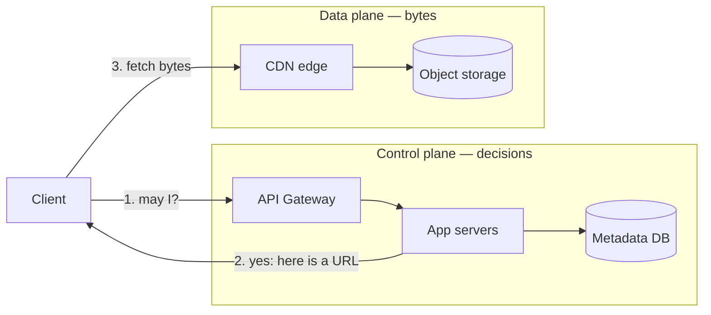

# File Storage Architecture at Scale

How large, security-sensitive platforms serve two very different kinds of files — small public assets viewed by everyone, and large private documents that must be downloaded or shared — without letting either one compromise the other.

Written as a reference for `oan_a2c`. The last section maps it back to where we actually are.

---

## 1. The split: two planes, one authority

The single most important structural decision is that **files do not travel through the API gateway or the application servers**. The application decides _who may access what_; storage and the CDN move the bytes.



The application never proxies file content. It answers a question and hands back a URL. This one rule is what makes the rest possible: the gateway stays small and cheap, byte volume scales independently of request volume, and the firewall rule "only the gateway may reach the app" stays absolute with no carve-outs.

**The authorization decision still lives in the application.** Moving bytes out of the app does not move the security boundary out of the app. It moves it to the _moment a URL is issued_.

---

## 2. Which tier does a file belong to?

Classify by **consequence of disclosure**, never by file size or by which screen shows it.

|                     | Public tier                                      | Private tier                                                |
| ------------------- | ------------------------------------------------ | ----------------------------------------------------------- |
| Examples            | Logos, avatars, product images, marketing assets | KYC documents, loan attachments, consent receipts, ID scans |
| Typical size        | Small (KB)                                       | Large (MB–GB)                                               |
| Access pattern      | Many per page, every page, every user            | One at a time, on deliberate user action                    |
| Read volume         | Very high                                        | Low                                                         |
| Cacheability        | Essential                                        | Irrelevant                                                  |
| Auth on fetch       | None                                             | Always                                                      |
| Consequence of leak | Negligible                                       | Regulatory incident                                         |

The asymmetry in the last two rows is what drives two different designs. It is not laziness about the public tier — it is that caching pressure and security pressure point in opposite directions, and they land on different files.

> **The classification is a policy decision, not a technical one.** Write it down per field. "Avatars are public" should be a recorded decision someone signed off on, not an accident of which upload helper a developer reached for.

---

## 3. Public tier: small, hot, unauthenticated

### Design

- **Opaque keys.** The storage key is a random token or content hash — never the uploaded filename. `/files/8f21c0b4e95d…png`, not `/files/acme-logo.png`. This removes enumeration entirely, and simultaneously eliminates the filename-collision, unicode, and path-traversal bug classes.
- **Immutable URLs.** A key never changes content. Edits write a _new_ key. This lets you set `Cache-Control: public, max-age=31536000, immutable` and never think about invalidation.
- **CDN in front, origin locked.** The bucket is reachable only by the CDN; the app origin serves no files at all.
- **No auth on fetch.** Deliberate, for a reason worth stating precisely.

### Why public assets are not authenticated

Browsers do not attach `Authorization` headers to subresource requests. `` fires a plain GET. So "authenticated images" must use one of:

- signed URLs (credential in the query string),
- signed cookies (credential in a cookie scoped to a path prefix),
- or `fetch()` + blob URLs in JavaScript.

The third destroys caching and adds real complexity. The first two are viable but pointless for content whose disclosure costs nothing. For a logo a company publishes deliberately, authentication buys nothing and costs a cache miss per image per page.

**The honest security claim** for this tier is: _unguessable, not protected_. An opaque key is a capability URL — anyone holding it can fetch it, forever. That is acceptable for brand assets and profile photos. It is not acceptable for anything else, and the moment someone proposes putting a document here, the answer is no.

### Avatars specifically

Personal photographs sit at the boundary and people argue about them. The settled industry answer — GitHub, Slack, Google profile photos — is **public CDN with an unguessable key**. The reasoning: avatars render many-per-page (team lists, comment threads), so they inherit the public tier's caching requirements; and an unguessable key means the only way to obtain one is to already have been shown it.

If a jurisdiction or customer contract requires access-controlled avatars, use **signed cookies**, not signed URLs — one cookie covers every avatar on the page and URLs stay cacheable.

---

## 4. Private tier: large, cold, sensitive

Large files change the design in ways that have nothing to do with security — and then security constrains what remains.

### Upload: direct to storage, never through the app

Routing a 500 MB upload through application workers is how you exhaust a thread pool. At scale the pattern is:

1. Client calls the API: "I want to upload a document to application X."
2. App checks permission, creates a metadata row in `pending` state, returns a **presigned PUT** (or multipart upload ID) scoped to one key.
3. Client uploads **directly to storage** — multipart, parallel, resumable.
4. Client calls the API again: "done." App verifies the object exists, checks size and type, flips the row to `active`.

The app handles three small JSON requests instead of 500 MB of body. Multipart upload also gives you resumability, which matters on the mobile networks a field agent is actually using.

> **Base64-in-JSON is the anti-pattern here.** It inflates payloads ~33%, forces the whole file into memory, and blocks a worker for the duration. It is acceptable only for small files with a hard size cap.

### Download: authorize in the app, transfer at the edge

1. Client calls the API: "give me document Y."
2. App runs the real permission check — tenant scope, role, record-level rules.
3. App writes an **audit record**: who, what, when, from where.
4. App returns a **presigned GET**, expiring in minutes.
5. Client fetches directly from storage/CDN.

The permission check is unchanged from a naive implementation. Only the final step differs: return a URL instead of streaming bytes.

### Presigned URL discipline

Three rules, and the third is the one that causes incidents:

1. **Short expiry.** Minutes, not days. Long enough to start a large download; the transfer may outlive the URL because authorization happens at connection time.
2. **Narrowest possible scope.** One key, one method. Never a prefix, never `PUT` on a download URL.
3. **Never persist a presigned URL.** It is a transient credential, not an address. Store the **file ID or key** in your records and mint the URL at read time. A presigned URL written into a database row becomes a dead link within the hour — and if that row is a compliance record, you have corrupted an audit trail.

---

## 5. Sharing: the genuinely hard part

"Download" is a solved problem. **Sharing** — where a file reaches someone who was not the original requester — is where most real-world leaks originate. A presigned URL is a bearer token: whoever holds it has access, and links get forwarded, pasted into tickets, and screenshotted.

### A share is a record, not a URL

The durable design makes a share a **first-class database object**, not a generated link:

```
Share {
  id, file_id,
  audience:      user | organization | email | anyone-with-link
  permissions:   view | download
  expires_at,    revoked_at,
  created_by,    created_at,
  password_hash?, watermark?, download_limit?
}
```

The recipient receives a **stable, opaque share URL** — `/s/7f3a9c…`. Opening it hits the _application_, which resolves the share record, re-evaluates it live (revoked? expired? limit hit? recipient still employed?), writes an access log, and only then mints a short-lived presigned URL for the actual bytes.

This inversion is the whole trick:

|                     | Raw presigned URL             | Share record + short-lived URL     |
| ------------------- | ----------------------------- | ---------------------------------- |
| Revocable           | ❌ Only by waiting for expiry | ✅ Instantly                       |
| Auditable           | ❌ One log line at issuance   | ✅ Every single access             |
| Expiry              | Fixed at creation             | Changeable after the fact          |
| Recipient known     | ❌                            | ✅ (when audience is a user/email) |
| Survives forwarding | Leaks silently                | Logged, and blockable              |

The share link is long-lived and safe to paste into an email. The presigned URL behind it lives for two minutes and is never seen by a human.

### Choosing an audience level

- **Internal user / organization** — recipient authenticates; strongest, always prefer it.
- **Named email** — recipient proves control of the address (magic link / OTP). Good for external counterparties such as a regulator or partner bank.
- **Anyone with the link** — a capability URL. Sometimes genuinely necessary. Mitigate with short expiry, download limits, optional password, watermarking, and _loud_ UI that says this is unauthenticated.

For regulated documents, "anyone with the link" should be disabled by policy rather than left to user judgment.

### Watermarking and controlled viewing

For the highest-sensitivity documents, platforms render a watermarked preview (recipient identity, timestamp) in an in-browser viewer and never hand over the original bytes. This does not prevent a photograph of the screen — nothing does — but it makes leaks attributable, which changes behaviour.

---

## 6. Security controls that matter at this scale

| Control                                                      | What it prevents                                                                                                                                               |
| ------------------------------------------------------------ | -------------------------------------------------------------------------------------------------------------------------------------------------------------- |
| **Authorization at issuance**                                | The only real gate. Every presigned URL must be preceded by the same permission check a streaming endpoint would run.                                          |
| **Tenant-namespaced keys** (`bank_id/…`)                     | Cross-tenant access via key guessing; makes bucket policies expressible per tenant.                                                                            |
| **Audit log on every issuance and every share access**       | Regulatory requirement, and the only way to answer "who saw this document?" after an incident.                                                                 |
| **Content-type and `Content-Disposition` pinning at upload** | Stored XSS. An uploaded `.svg` or `.html` served inline from your origin executes as your origin. Force `attachment` for anything not a known-safe image type. |
| **Magic-byte validation, not extension trust**               | Extension spoofing.                                                                                                                                            |
| **Malware scanning before `active`**                         | Your platform becoming a malware distribution channel. Files stay quarantined until scanned.                                                                   |
| **Encryption at rest with a managed key (KMS)**              | Compliance baseline; enables cryptographic erasure.                                                                                                            |
| **Rate limiting on URL _issuance_, not on bytes**            | Bulk exfiltration. Byte traffic is at the CDN where your gateway cannot see it — so the limit belongs on the API call that mints URLs.                         |
| **Public-access block on private buckets, verified in CI**   | The single most common catastrophic cloud misconfiguration. Assert it in a test; do not trust the console.                                                     |

Two easily-missed points:

- **Private and public files must live in separate buckets.** Not separate prefixes — separate buckets, with different policies. A prefix-based split is one policy mistake away from exposing everything.
- **Rate limiting is genuinely different here.** Once bytes bypass your gateway, the gateway can no longer throttle them. A user who can mint 10,000 presigned URLs per minute can exfiltrate an archive regardless of how tight your byte-level limits used to be.

---

## 7. Caching and cost

At millions of users the public tier is almost entirely a caching problem:

- **Immutable keys + one-year `max-age`** give near-100% CDN hit rates.
- **Signed cookies over signed URLs** wherever access control is required on many-per-page assets, because signed URLs fragment the cache key.
- **Expiry bucketing** if you must use signed URLs: round expiry to a boundary so every viewer in the window gets a byte-identical URL and the CDN can cache it.
- **Egress dominates the bill.** CDN hit-rate work is cost work, not just latency work.

The private tier is the opposite: low request rate, large transfers, cache-hostile by design. Do not try to cache it — `Cache-Control: private, no-store`.

---

## 8. What breaks over years

Scale problems are visible and get fixed. Time problems are invisible until a migration.

**Never persist URLs in business records.** Store an opaque file ID; resolve to a URL at read time. A consent receipt written in 2026 will be referenced in 2033, across at least one storage migration. If the record holds `https://old-bucket.s3.../key`, every migration is a data migration, and every row you miss is a broken reference inside a compliance record.

If you must expose a permanent URL, commit to a **hostname you control** (`https://media.company.com/<key>`) and treat it as a public contract — it can be re-pointed at any backend later.

**Keys are immutable and forever.** Never reuse a key for different content; a cached copy somewhere will serve the wrong bytes. Deletion is a lifecycle policy plus cache purge, not an overwrite.

**Retention and legal hold** are storage-layer features (versioning, object lock). Build on them rather than reimplementing them in application code.

---

## 9. Anti-patterns

| Anti-pattern                                                   | Why it fails                                                       |
| -------------------------------------------------------------- | ------------------------------------------------------------------ |
| Streaming large files through app workers                      | Thread-pool exhaustion; caps concurrency at a handful of downloads |
| Base64 file payloads in JSON                                   | ~33% inflation, whole file in memory, worker blocked               |
| Storing presigned URLs in the database                         | Dead links within the hour; corrupted audit records                |
| Predictable keys (`/files/<original-name>.pdf`)                | Enumeration                                                        |
| One bucket for public and private files                        | One policy error exposes everything                                |
| Making the bucket public so the integration "just works"       | Silently converts the private tier to world-readable               |
| Sharing by handing out a raw presigned URL                     | Unrevocable, unauditable, forwards silently                        |
| Relying on `Referer` checks or URL obscurity as access control | Trivially bypassed; not a control                                  |
| Rate limiting bytes but not URL issuance                       | Bulk exfiltration walks straight past it                           |

---

## 10. Where `oan_a2c` stands

**Correct today**

- Private files (`A2C Loan Application` attachments, bank KYC PDFs, consent receipts, farmer certification photos) are stored with `is_private=1` and reachable only through permission-checked endpoints — `download_supporting_document` and `download_kyc_document`.
- Those two endpoints are the _only_ places the application reads file bytes. That single seam is what makes a future storage migration a small change rather than a sweep.
- Public image upload (`POST /v1/images`) stores an opaque 32-character key, so public assets are no longer enumerable.
- Upload validation checks magic bytes and constrains extensions, so the stored-XSS vector is closed on that path.

**Known gaps**

| Gap                                                                                                                | Impact                                                                                                                                            |
| ------------------------------------------------------------------------------------------------------------------ | ------------------------------------------------------------------------------------------------------------------------------------------------- |
| Public files are served directly off the app origin (`/files/`), and Kong has no route for them                    | At gateway cutover, when the app ingress is firewalled to Kong only, every logo and avatar breaks. Decide the media origin _before_ that cutover. |
| Business records store `file_url` strings (`kyc_document`, `consent_form_attachment`, `logo`) rather than file IDs | A storage migration becomes a data migration across historical regulatory records.                                                                |
| Uploads are base64-in-JSON with a 5 MB cap                                                                         | Acceptable at current sizes; will not survive larger documents. Direct-to-storage upload is the exit.                                             |
| No malware scanning on uploaded documents                                                                          | Bank-supplied PDFs are ingested unscanned.                                                                                                        |
| No sharing model                                                                                                   | If document sharing is ever required, build the share-record pattern from §5 — do not hand out presigned URLs.                                    |

**Suggested order of work**

1. Decide the public media hostname before the Kong cutover (blocking; everything else is not).
2. Migrate `file_url` columns to file IDs with a resolver — cheapest now, most expensive later.
3. Move the public tier to object storage + CDN (public bucket only; private files stay where they are — this keeps both download endpoints working untouched).
4. Direct-to-storage upload for the private tier when document sizes demand it.
5. Malware scanning in the upload pipeline.

---

---

## Appendix: Adopting external object storage (S3 and compatible)

### Is it the right call?

Yes — and **starting with the public tier only is the lowest-risk way in**.

Object storage is the default for user-uploaded files in any system expected to outgrow one server, and the reasons are mostly not about security:

- **Stateless app servers.** Files on local disk mean you cannot add, replace, or lose a node without a shared volume. This is what forces the move, long before anyone considers enumerable filenames.
- **Durability.** S3-class storage quotes eleven nines. A single attached volume plus periodic snapshots does not.
- **Offloading bytes.** Presigned transfers keep large files out of the application process entirely.
- **Lifecycle and audit.** Versioning, object lock (WORM), retention policy, per-object access logs — all things a compliance auditor eventually asks for, and all things you would otherwise hand-build.

Note that "S3" is shorthand for **the S3 API, not AWS**. GCS, Azure Blob, Cloudflare R2, MinIO, and Ceph RGW all speak it. Write against the API once and the endpoint becomes configuration — which is what lets a cloud-hosted staging environment and an on-premises production environment run the same code. For on-prem or data-residency-constrained deployments, **MinIO** is the usual self-hosted answer.

### Public-tier-first is a real strategy, not a half-measure

Moving only public files avoids the single most dangerous failure mode of a storage migration: a bucket policy change silently converting your private tier to world-readable. If private documents never enter the bucket, that class of incident cannot occur.

It also happens to be the cheapest change, because public files are only ever _referenced_ by URL — nothing in the application reads their bytes.

### The URL question: store relative, resolve at the boundary

The instinct to keep a relative path in the database and let the client prepend a base URL is **correct**, and it is worth being precise about why.

| Approach                           | Stored value                      | Verdict                                                                            |
| ---------------------------------- | --------------------------------- | ---------------------------------------------------------------------------------- |
| Absolute URL in the record         | `https://bucket.s3.../8f21c0.png` | ❌ Every host change becomes a data migration across historical records            |
| Relative path, client prepends     | `/files/8f21c0.png`               | ⚠️ Works, but every client (web, mobile, partner) must know and track the base URL |
| **Relative path, server resolves** | `/files/8f21c0.png`               | ✅ **Recommended**                                                                 |

A relative path _is_ an opaque key — so storing it already satisfies the "never persist URLs" rule from §8. The remaining question is only **who turns the key into a URL**.

Doing it in the client scatters the base URL across every consumer; changing CDN host then means coordinating releases across web, mobile, and any partner integration. Doing it server-side, at response-serialization time, keeps one source of truth:

```
Database:     logo = "/files/8f21c0b4e95d47a3bd6178e2c0f4a91d.png"
API response: "logo_url": "https://media.example.com/8f21c0b4e95d47a3bd6178e2c0f4a91d.png"
```

Records never change. The host is configuration. Clients render whatever absolute URL they are handed and know nothing about storage.

### What changes in a Frappe app

Frappe exposes hooks for **write** (`write_file`, `before_write_file`) and **delete** (`delete_file_data_content`), but **not for read** — `File.get_content()` performs a plain local `open()`. That asymmetry is what makes public-only adoption cheap and full adoption more involved.

For the public tier alone:

1. **A `write_file` hook that branches on privacy.** The hook fires for _every_ File insert, so it must fall through for private files or it will push confidential documents into the bucket:

   ```python
   def write_file(file_doc):
       if file_doc.is_private:
           return save_file_on_filesystem(file_doc)   # unchanged
       return upload_to_object_storage(file_doc)      # public tier only
   ```

2. **A matching `delete_file_data_content` hook**, branching the same way.

3. **Resolution at the API boundary** — a helper that maps a stored `/files/<key>` to the configured media base URL, applied where file fields are serialized into responses.

4. **Keep `file_url` relative.** Frappe passes any value starting with `http(s)://` through untouched when resolving paths, so writing an absolute URL into `file_url` both persists a host into your records and changes how the framework treats the field. Storing the relative key avoids both.

Because private files stay on local disk under this plan, the two endpoints that read bytes (`download_supporting_document`, `download_kyc_document`) keep working with no modification at all.

**One consequence to accept:** Frappe's own Desk UI resolves `/files/...` against local disk, so public images will not render in the admin interface unless the origin serves a redirect for that path to the media host. A small nginx `302` on `/files/` covers it.

### Is this what large enterprises actually do?

Yes. The near-universal shape is: private buckets, CDN in front, opaque keys, presigned URLs for anything protected, and **an ID or key in the database with URL construction at read time**. The variations are in the details — some organizations run a dedicated media service rather than resolving inline, some use signed cookies instead of signed URLs, some content-address everything by hash — but the store-a-key-resolve-late principle is constant, because it is what allows storage to be re-platformed without touching historical records.

The genuine divergence is deployment target, not architecture: regulated and on-premises systems run the same design against self-hosted S3-compatible storage rather than a public cloud.

## Summary

- Two tiers, classified by **consequence of disclosure**, separated into **different buckets**.
- The application **authorizes**; storage and the CDN **transfer**. Bytes never cross the app.
- Public: opaque keys, immutable URLs, long cache, no auth — _unguessable, not protected_.
- Private: authorize → audit → short-lived presigned URL → direct transfer.
- Sharing: a **share record** the app re-evaluates on every open, never a raw presigned URL.
- Store **file IDs**, never URLs.
- Rate limit **URL issuance**, because you can no longer see the bytes.
